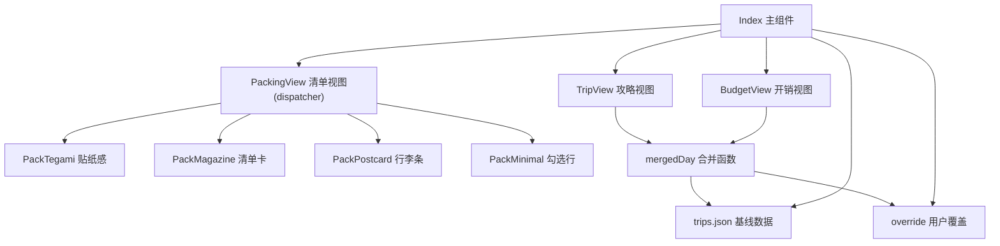
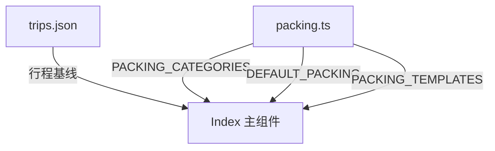
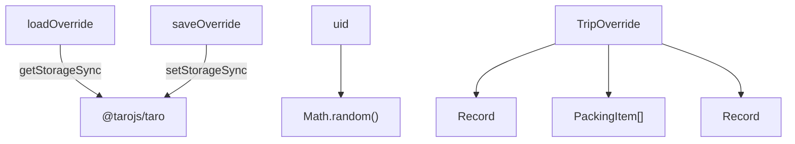
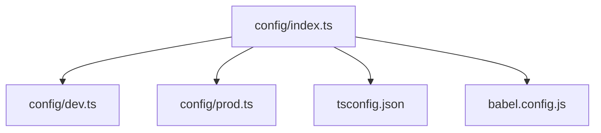
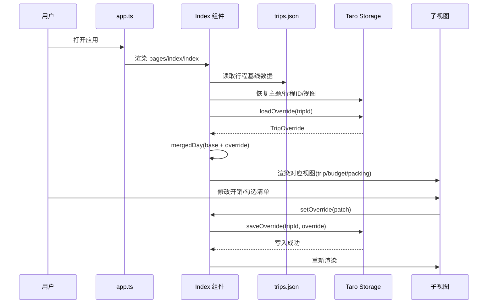

# CODEMAP.md

## 1. 项目概述

**行迹**是一个基于 Taro 框架的跨平台旅行管理小程序（支持微信小程序、H5 等 9 个目标平台），提供旅行攻略浏览、开销预算统计、行李打包清单整理三大核心功能。项目采用静态 JSON 数据源 + 本地 Storage 覆盖方案，无需服务端依赖即可离线使用。

> **章节来源**
> → 详见 [trip-core](../openspec/specs/trip-core/spec.md)
> → 详见 [project-config](../openspec/specs/project-config/spec.md)
> → 详见 [packing-data](../openspec/specs/packing-data/spec.md)
> → 详见 [override-utils](../openspec/specs/override-utils/spec.md)

## 2. 技术栈

- **前端**：React 18.0.0 + TypeScript 5.4.5 + Taro 4.2.0（跨平台框架）+ SCSS
- **构建工具**：Webpack 5.91.0 + Babel 7.24.4（babel-preset-taro）+ npm
- **数据库**：无服务端数据库，使用 Taro Storage API（本地持久化）+ 静态 JSON 数据源
- **代码质量**：Husky 9.1.7 + Commitlint 19.8.1 + Stylelint 16.4.0 + ESLint 8.57.0

> **章节来源**
> → 详见 [project-config §2](../openspec/specs/project-config/spec.md)
> → 详见 [trip-core §6](../openspec/specs/trip-core/spec.md)
> → 详见 [override-utils §6](../openspec/specs/override-utils/spec.md)

## 3. 项目结构

- **config/** — Taro 构建配置层，包含基础配置（index.ts）、开发环境配置（dev.ts）、生产环境配置（prod.ts）
- **src/** — 应用源码目录，包含入口文件（app.ts/app.config.ts）、页面（pages/）、数据层（data/）、类型定义（types/）、工具函数（utils/）
- **src/pages/index/** — 唯一页面，包含主页面组件（index.tsx）、样式（index.scss）、页面配置（index.config.ts），是三大视图（攻略/开销/清单）的集中入口
- **src/data/** — 纯数据层，包含行程基线数据（trips.json）和打包清单模板（packing.ts）
- **src/types/** — TypeScript 类型定义层，定义行程相关的所有接口（TripData、Day、Spot 等）
- **src/utils/** — 工具函数层，提供本地存储读写封装（override.ts）
- **types/** — 全局类型声明，包含静态资源模块声明和环境变量类型
- **根目录配置** — TypeScript 编译配置（tsconfig.json）、Babel 转译配置（babel.config.js）、微信小程序项目配置（project.config.json）、代码质量工具配置（commitlint.config.mjs、stylelint.config.mjs）

> **章节来源**
> → 详见 [project-config §2](../openspec/specs/project-config/spec.md)
> → 详见 [trip-core §2](../openspec/specs/trip-core/spec.md)

## 4. 模块详解

### 4.1 模块：src/pages/index

**职责**：旅行行程管理的核心业务模块，提供攻略浏览、开销预算统计和行李打包清单三大视图，是用户交互的唯一入口。

#### 项目结构
- **页面组件层**：`index.tsx`（568 行）包含主组件 Index 和三个子视图组件（TripView、BudgetView、PackingView）
- **样式层**：`index.scss`（685 行）通过 CSS 变量驱动四种主题风格（手紙/杂志/明信片/极简）
- **配置层**：`index.config.ts` 配置页面导航栏标题

#### 核心组件

**Index（主页面组件）** — 状态中枢和视图路由器
- 在挂载时完成四项初始化：读取 `trips.json` 获取所有行程基线、从 Storage 恢复主题/视图/当前行程偏好、加载用户覆盖数据（`loadOverride`）、设置默认激活日期
- 通过六个 state（theme、view、tripId、override、activeDayId 等）管理全局状态
- `useEffect` 监听 `[tripId, override]`，任何覆盖变更自动写入 Storage，无需手动保存按钮
- 通过 `view` state 在 TripView/BudgetView/PackingView 间切换，而非多页面跳转
- 来源：详见 [trip-core §4](../openspec/specs/trip-core/spec.md)

**mergedDay（数据合并函数）** — 基线与覆盖数据合并
- 接收基线 Day 对象，查找对应的 DayOverride（如果存在），将用户自定义的住宿价格、餐饮费用、门票费用覆盖到基线数据上
- 采用不可变模式——返回全新对象而非修改入参，避免副作用
- 住宿价格优先使用 `override.hotelPrice`，回退到 `d.hotel.price`
- 来源：详见 [trip-core §4](../openspec/specs/trip-core/spec.md)

**BudgetView（开销视图）** — 开销汇总与人均计算
- 通过 `aggregateBudget()` 工具函数聚合四类开销（住宿/交通/餐饮/景点），计算总额、人均、每日趋势和最贵一笔
- 环形 donut 图使用 conic-gradient 实现，颜色通过 CSS 变量（`var(--plum/leaf/accent/sun)`）支持四主题漂移
- 每日花销折线图使用 SVG via data URI 实现，`currentColor` 由父元素 `color: var(--accent)` 决定，主题自动适配
- 分类明细区按类型分组展示所有有价格的 spot，点击可编辑
- 来源：详见 [trip-core §5](../openspec/specs/trip-core/spec.md)

**PackingView（清单视图）** — 清单管理与模板导入，按主题分发四套版式
- `index.tsx` 为薄 dispatcher，保留 state + CRUD + TemplateImport 弹层，按当前 theme 渲染子组件
- `PackTegami`（手帖贴纸感）：圆角 chip 网格，勾选后暖橘填充 + 删除线
- `PackMagazine`（刊物清单卡）：粗线大字分类标题 + 黑色方框复选 □/■
- `PackPostcard`（护照行李条）：斜纹底 + 行李条 + 圆形戳 + 条形码细纹
- `PackMinimal`（极简勾选行）：极淡 hairline + 边框方框复选 + 删除线已勾
- `shared.ts`：共用 `PackViewProps` 接口，4 子组件统一 props 形状
- 模板导入检测当前清单是否为空：空则直接替换；非空则弹出确认面板提供"合并"/"替换"/"取消"三种策略
- 合并策略通过 Set 去重（key 为 `${category}::${label}`），确保不引入重复项
- 来源：详见 [trip-core §5](../openspec/specs/trip-core/spec.md)

#### 模块架构



> **图表来源**
> → 详见 [trip-core §4](../openspec/specs/trip-core/spec.md)
> → 详见 [trip-core §5](../openspec/specs/trip-core/spec.md)

#### 对外接口

| 接口 | 签名 | 用途 | 来源 |
|------|------|------|------|
| `loadOverride(tripId)` | `(tripId: string) → TripOverride` | 从本地存储加载行程覆盖数据 | [trip-core §4](../openspec/specs/trip-core/spec.md) |
| `saveOverride(tripId, ov)` | `(tripId: string, ov: TripOverride) → void` | 将覆盖数据持久化到本地存储 | [trip-core §4](../openspec/specs/trip-core/spec.md) |
| `switchTrip(tripId)` | `(tripId: string) → void` | 切换当前行程并重置激活日 | [trip-core §4](../openspec/specs/trip-core/spec.md) |
| `switchTheme(theme)` | `(theme: ThemeId) → void` | 切换视觉主题并持久化 | [trip-core §4](../openspec/specs/trip-core/spec.md) |
| `setOverride(patch)` | `(patch: Partial<TripOverride>) → void` | 局部更新覆盖数据 | [trip-core §4](../openspec/specs/trip-core/spec.md) |

#### 文件清单

| 文件 | 行数 | 层级 | 用途 |
|------|------|------|------|
| [index.tsx](../src/pages/index/index.tsx) | 567 | adapter | 主页面组件 + 三大视图子组件 |
| [index.scss](../src/pages/index/index.scss) | 684 | view | 页面样式定义，CSS 变量驱动主题 |
| [index.config.ts](../src/pages/index/index.config.ts) | 3 | config | 页面导航栏标题配置 |
| [helpers.ts](../src/views/BudgetView/helpers.ts) | 100 | service | BudgetView 价格聚合 / donut 角度 / 折线点计算 |
| [DailyChart.tsx](../src/views/BudgetView/DailyChart.tsx) | 74 | view | 每日花销折线 SVG 卡（SVG via data URI） |

> **章节来源**
> → 详见 [trip-core §2](../openspec/specs/trip-core/spec.md)
> → 详见 [trip-core §4](../openspec/specs/trip-core/spec.md)
> → 详见 [trip-core §5](../openspec/specs/trip-core/spec.md)

### 4.2 模块：src/data

**职责**：纯数据层，提供行程基线数据和行李打包清单模板，不包含任何业务逻辑或 UI 代码。

#### 项目结构
- **行程数据**：`trips.json`（1785 行）存储所有行程的完整数据（景点、交通、住宿、天气、清单等），支持多个行程共存
- **打包清单**：`packing.ts`（86 行）导出类型接口（PackingCategory、PackingTemplate）和常量数据（PACKING_CATEGORIES、DEFAULT_PACKING、PACKING_TEMPLATES）

#### 核心组件

**trips.json（行程基线数据）** — 只读数据源
- 包含完整的行程信息：天数、景点（Spot）、交通段（TransportSegment）、住宿（Hotel）、天气、预算等
- 采用"基线不可变"设计模式——用户修改通过 override 层叠加，不直接修改基线
- 支持多个行程共存（store.currentId 指定默认行程）
- 来源：详见 [trip-core §2](../openspec/specs/trip-core/spec.md)

**PACKING_CATEGORIES 与 DEFAULT_PACKING** — 分类体系与默认物品
- PACKING_CATEGORIES 定义 6 个顶级分类（证件/衣物/电子/洗漱/药品/其他），每个分类由 id、label（中文显示名）、icon（单字符 Unicode 图标）组成
- DEFAULT_PACKING 使用 `[string, string]` 元组数组形式，18 项默认物品均匀分布在 6 个分类中（每类 3 项）
- 采用元组而非对象 `{ categoryId, name }`，使数据更紧凑（减少 key 名重复），序列化时占用更少字节
- 来源：详见 [packing-data §4](../openspec/specs/packing-data/spec.md)

**PACKING_TEMPLATES** — 场景化模板
- 包含 6 套针对不同旅行场景的预设模板（国内基础/江浙华南夏/东北华北冬/高原游/出境游/短途周末）
- "国内 · 基础"模板直接引用 DEFAULT_PACKING 常量，避免数据重复
- 各场景模板只包含该场景特有的物品，而非全量物品 + 差异化项
- 来源：详见 [packing-data §4](../openspec/specs/packing-data/spec.md)

#### 模块架构



> **图表来源**
> → 详见 [trip-core §2](../openspec/specs/trip-core/spec.md)
> → 详见 [packing-data §3](../openspec/specs/packing-data/spec.md)

#### 对外接口

| 接口 | 签名 | 用途 | 来源 |
|------|------|------|------|
| `PACKING_CATEGORIES` | `PackingCategory[]` | 6 个预设打包分类定义 | [packing-data §4](../openspec/specs/packing-data/spec.md) |
| `DEFAULT_PACKING` | `Array<[string, string]>` | 18 项基础打包物品 | [packing-data §4](../openspec/specs/packing-data/spec.md) |
| `PACKING_TEMPLATES` | `PackingTemplate[]` | 6 套场景模板 | [packing-data §4](../openspec/specs/packing-data/spec.md) |

#### 文件清单

| 文件 | 行数 | 层级 | 用途 |
|------|------|------|------|
| [trips.json](../src/data/trips.json) | 1785 | model | 行程基线数据（只读） |
| [packing.ts](../src/data/packing.ts) | 86 | model | 打包清单类型与模板数据 |

> **章节来源**
> → 详见 [trip-core §2](../openspec/specs/trip-core/spec.md)
> → 详见 [packing-data §4](../openspec/specs/packing-data/spec.md)

### 4.3 模块：src/utils

**职责**：旅行覆盖数据本地存储工具，管理用户自定义的行程开销调整、打包清单勾选状态和交通费用覆盖。

#### 项目结构
- **类型定义**：`override.ts` 导出三个 TypeScript 接口（DayOverride、PackingItem、TripOverride）
- **存储操作**：`override.ts` 提供 `loadOverride()` 和 `saveOverride()` 两个函数，封装 Taro 本地存储的读写逻辑
- **辅助工具**：`override.ts` 导出 `uid()` 函数，生成随机字符串用于打包清单项的唯一标识

#### 核心组件

**loadOverride** — 防御性数据加载
- 接收 tripId 参数，拼接存储键 `trip-override::{tripId}` 后调用 `Taro.getStorageSync()` 获取原始数据
- 三层防御机制：Taro 键不存在时返回空字符串 → 通过 `typeof raw === 'object'` 类型守卫过滤脏数据 → 通过 `raw.days || {}` 等逻辑合并默认值
- 永远返回可用数据，调用方无需处理 null 或 undefined
- 来源：详见 [override-utils §4](../openspec/specs/override-utils/spec.md)

**saveOverride** — 全量覆盖写入
- 接收 tripId 和完整的 TripOverride 对象，拼接存储键后调用 `Taro.setStorageSync()` 进行同步写入
- 采用全量覆盖策略而非增量更新——每次保存都写入完整对象，简化存储逻辑，避免合并冲突
- 同步写入确保写入完成后立即返回，调用方无需处理 Promise
- 来源：详见 [override-utils §4](../openspec/specs/override-utils/spec.md)

**TripOverride 数据结构** — 三维度覆盖数据
- days（每日开销覆盖）：使用 `Record<number, DayOverride>` 映射，key 为行程第几天（从 1 开始）
- packing（打包清单）：使用数组而非映射，保持顺序且支持动态增删
- transport（交通费用）：使用 `Record<string, number>`，key 为交通方式，value 为费用
- 来源：详见 [override-utils §5](../openspec/specs/override-utils/spec.md)

#### 模块架构



> **图表来源**
> → 详见 [override-utils §2](../openspec/specs/override-utils/spec.md)
> → 详见 [override-utils §3](../openspec/specs/override-utils/spec.md)

#### 对外接口

| 接口 | 签名 | 用途 | 来源 |
|------|------|------|------|
| `loadOverride(tripId)` | `(tripId: string) → TripOverride` | 从本地存储加载并校验行程覆盖数据 | [override-utils §4](../openspec/specs/override-utils/spec.md) |
| `saveOverride(tripId, ov)` | `(tripId: string, ov: TripOverride) → void` | 将行程覆盖数据持久化到本地存储 | [override-utils §4](../openspec/specs/override-utils/spec.md) |
| `uid()` | `() → string` | 生成 8 位随机字符串作为清单项 ID | [override-utils §4](../openspec/specs/override-utils/spec.md) |

#### 文件清单

| 文件 | 行数 | 层级 | 用途 |
|------|------|------|------|
| [override.ts](../src/utils/override.ts) | 42 | service | 覆盖数据本地存储与加载 |

> **章节来源**
> → 详见 [override-utils §2](../openspec/specs/override-utils/spec.md)
> → 详见 [override-utils §4](../openspec/specs/override-utils/spec.md)

### 4.4 模块：src/types

**职责**：TypeScript 类型定义层，确保行程数据的契约一致性。

#### 项目结构
- **类型定义**：`trip.ts` 定义完整的 TypeScript 接口（Spot、Hotel、Weather、Day、TransportSegment、TripData、Trip、TripStore）

#### 核心组件

**Trip 接口体系** — 行程数据契约
- Spot：景点信息（type、time、name、note）
- Hotel：住宿信息（name、price、nights、note）
- Weather：天气缓存（icon、temp、desc）
- Day：行程天（id、spots、weather、hotel）
- TransportSegment：交通段（id、from、to、price、note）
- TripData/Trip/TripStore：行程聚合与存储结构
- 来源：详见 [trip-core §2](../openspec/specs/trip-core/spec.md)

#### 文件清单

| 文件 | 行数 | 层级 | 用途 |
|------|------|------|------|
| [trip.ts](../src/types/trip.ts) | 75 | model | 行程相关 TypeScript 接口定义 |

> **章节来源**
> → 详见 [trip-core §2](../openspec/specs/trip-core/spec.md)

### 4.5 模块：config

**职责**：Taro 多端项目的构建配置层，是所有开发、构建、部署流程的入口。

#### 项目结构
- **核心构建配置**：`config/index.ts` 定义基础构建参数（设计稿宽度 750、源码目录 src、输出目录 dist、React 框架、Webpack 5 编译器），根据 NODE_ENV 动态合并开发或生产配置
- **环境差异化配置**：`config/dev.ts` 配置开发环境日志输出；`config/prod.ts` 预留生产环境 Webpack 优化插件入口

#### 核心组件

**config/index.ts（构建配置入口）** — 分层合并策略
- 使用 `defineConfig` 辅助函数导出 async 函数，接收 merge 工具和上下文参数
- "基础配置 + 环境配置"分层合并：baseConfig 包含所有平台共有配置项，devConfig/prodConfig 仅包含环境差异项
- 通过 `process.env.NODE_ENV` 判断当前环境，使用 `merge()` 深度合并
- tsconfig-paths 双端注入：在 mini.webpackChain 和 h5.webpackChain 中均注入 TsconfigPathsPlugin，确保小程序端和 H5 端都能解析 `@/*` 别名
- 来源：详见 [project-config §4](../openspec/specs/project-config/spec.md)

#### 模块架构



> **图表来源**
> → 详见 [project-config §2](../openspec/specs/project-config/spec.md)
> → 详见 [project-config §5](../openspec/specs/project-config/spec.md)

#### 文件清单

| 文件 | 行数 | 层级 | 用途 |
|------|------|------|------|
| [index.ts](../config/index.ts) | 102 | config | Taro 构建基础配置 + 环境合并逻辑 |
| [dev.ts](../config/dev.ts) | 10 | config | 开发环境差异化配置 |
| [prod.ts](../config/prod.ts) | 33 | config | 生产环境差异化配置（预留优化插件） |

> **章节来源**
> → 详见 [project-config §2](../openspec/specs/project-config/spec.md)
> → 详见 [project-config §4](../openspec/specs/project-config/spec.md)

### 4.6 模块：src（应用入口）

**职责**：Taro 小程序的应用入口，定义根组件和全局窗口配置。

#### 项目结构
- **应用入口**：`src/app.ts` 定义 Taro 根组件，`useLaunch` 钩子记录启动日志
- **全局配置**：`src/app.config.ts` 配置小程序全局窗口样式（背景色、导航栏标题「行迹」）和懒加载策略
- **全局样式**：`src/app.scss` 全局样式文件（当前为空）

#### 核心组件

**app.ts（根组件）** — 应用启动入口
- 使用 `useLaunch` 钩子记录启动日志
- 渲染子页面（pages/index/index）
- 来源：详见 [trip-core §2](../openspec/specs/trip-core/spec.md)

#### 文件清单

| 文件 | 行数 | 层级 | 用途 |
|------|------|------|------|
| [app.ts](../src/app.ts) | 17 | entry | Taro 根组件 + 启动日志 |
| [app.config.ts](../src/app.config.ts) | 12 | config | 小程序全局窗口配置 |
| [app.scss](../src/app.scss) | 1 | view | 全局样式（当前为空） |

> **章节来源**
> → 详见 [trip-core §2](../openspec/specs/trip-core/spec.md)

## 5. 核心数据流

### 主数据流：用户操作 → 覆盖数据持久化 → 视图更新

用户在行迹应用中的任何自定义操作（修改开销、勾选清单、切换主题）均遵循"基线不可变、覆盖可编辑"的设计模式。主数据流如下：

1. **应用启动**：`app.ts` 渲染根组件 → 加载 `pages/index/index` → `Index` 组件初始化
2. **数据加载**：从 `trips.json` 读取行程基线 → 从 Taro Storage 恢复主题/行程 ID/视图偏好 → 调用 `loadOverride(tripId)` 获取用户覆盖数据
3. **视图渲染**：根据当前 `view` state 路由到 TripView/BudgetView/PackingView → 通过 `mergedDay()` 合并基线与覆盖数据 → 渲染 UI
4. **用户操作**：用户修改开销/勾选清单/切换主题 → 触发 `setOverride(patch)` → `useEffect` 监听 `[tripId, override]` 自动调用 `saveOverride()` 写入 Storage
5. **视图更新**：Storage 写入完成后 → React 状态更新 → 对应视图重新渲染



> **图表来源**
> → 详见 [trip-core §3](../openspec/specs/trip-core/spec.md)
> → 详见 [override-utils §3](../openspec/specs/override-utils/spec.md)

### 次数据流：构建配置分层合并

开发者执行构建脚本时，Taro CLI 读取 config/index.ts，根据 NODE_ENV 合并开发/生产配置后调用 Webpack 编译：

1. 开发者执行 `npm run dev:weapp` → npm 调用 `taro build --type weapp --watch`
2. Taro CLI 加载 `config/index.ts` → 读取 NODE_ENV（development）→ 加载 `config/dev.ts`
3. 使用 `merge(baseConfig, devConfig)` 深度合并 → 返回完整配置给 Webpack
4. Webpack 通过 TsconfigPathsPlugin 解析 `@/*` 别名 → Babel loader 转译 TSX/JS → PostCSS 处理 px→rpx 转换
5. 产物输出到 `dist/` 目录

> **图表来源**
> → 详见 [project-config §3](../openspec/specs/project-config/spec.md)

> **章节来源**
> → 详见 [trip-core §3](../openspec/specs/trip-core/spec.md)
> → 详见 [override-utils §3](../openspec/specs/override-utils/spec.md)
> → 详见 [project-config §3](../openspec/specs/project-config/spec.md)

## 6. 关键设计决策

- **基线不可变 + 覆盖可编辑**：`trips.json` 作为只读数据源，用户修改通过 `override` 层叠加，不直接修改基线。这使得数据更新（如 JSON 版本升级）不会丢失用户自定义内容。来源：[trip-core §4](../openspec/specs/trip-core/spec.md)、[trip-core §5](../openspec/specs/trip-core/spec.md)
- **同步本地存储（StorageSync）而非异步**：采用 Taro 的 `StorageSync` API 进行同步读写，简化调用方代码逻辑，避免异步状态管理复杂度。适用于轻量级用户偏好调整，对实时性要求不高。来源：[override-utils §1](../openspec/specs/override-utils/spec.md)、[override-utils §4](../openspec/specs/override-utils/spec.md)
- **元组数据结构 `[string, string]` 替代对象**：打包清单使用 `[category_id, item_name]` 二元组而非对象 `{ categoryId, name }`，JSON 序列化时减少约 30% 字符数，对移动端存储和传输更友好。来源：[packing-data §1](../openspec/specs/packing-data/spec.md)、[packing-data §5](../openspec/specs/packing-data/spec.md)
- **全量覆盖策略而非增量更新**：`saveOverride()` 每次保存都写入完整的 TripOverride 对象，简化存储逻辑，避免合并冲突。要求调用方遵循"加载-修改-保存"模式。来源：[override-utils §4](../openspec/specs/override-utils/spec.md)
- **三层防御性数据加载**：`loadOverride()` 通过"读取原始数据 → typeof 类型守卫 → 逻辑运算符合并默认值"三层防御机制，永远返回可用数据，调用方无需 null 检查。来源：[override-utils §5](../openspec/specs/override-utils/spec.md)
- **单页视图切换而非多页面跳转**：通过 `view` state 在 TripView/BudgetView/PackingView 间切换，保持单页应用体验，减少页面跳转开销。来源：[trip-core §4](../openspec/specs/trip-core/spec.md)
- **场景化模板直接引用默认列表**：PACKING_TEMPLATES 的"国内 · 基础"模板通过 `items: DEFAULT_PACKING` 直接引用，而非复制数组内容，保证默认列表修改后基础模板自动同步。来源：[packing-data §4](../openspec/specs/packing-data/spec.md)

> **章节来源**
> → 详见 [trip-core §4](../openspec/specs/trip-core/spec.md)
> → 详见 [trip-core §5](../openspec/specs/trip-core/spec.md)
> → 详见 [override-utils §4](../openspec/specs/override-utils/spec.md)
> → 详见 [override-utils §5](../openspec/specs/override-utils/spec.md)
> → 详见 [packing-data §4](../openspec/specs/packing-data/spec.md)
> → 详见 [packing-data §5](../openspec/specs/packing-data/spec.md)

## 7. 层级与依赖规则

### 7.1 层级定义（Layer 0-4）

```
Layer 0: 纯数据模型层
  └─ src/types/, src/data/*.ts, src/data/*.json — 纯接口定义与静态数据，无运行时依赖

Layer 1: 工具函数层
  └─ src/utils/ — 通用辅助函数（本地存储封装），仅依赖框架 API

Layer 2: 数据访问/存储层
  └─ src/utils/override.ts — Taro Storage API 封装，提供 loadOverride/saveOverride

Layer 3: 业务逻辑层
  └─ src/pages/index/ — 核心业务用例实现（攻略/开销/清单视图 + 状态管理）

Layer 4: 应用入口与配置层
  └─ src/app.ts, src/app.config.ts, config/ — 根组件、页面路由、构建配置
```

> **章节来源**
> → 详见 [trip-core §2](../openspec/specs/trip-core/spec.md)
> → 详见 [override-utils §2](../openspec/specs/override-utils/spec.md)
> → 详见 [packing-data §2](../openspec/specs/packing-data/spec.md)

### 7.2 依赖方向规则（高层 → 低层）

依赖方向为：L4 可依赖 L0-L3，L3 可依赖 L0-L2，L2 可依赖 L0-L1，L1 仅依赖外部框架 API，L0 不依赖任何内部包。

- **合法示例**：`src/pages/index/index.tsx` → `src/utils/override.ts`（L3 → L2 ✓）、`src/pages/index/index.tsx` → `src/data/packing.ts`（L3 → L0 ✓）、`src/pages/index/index.tsx` → `src/types/trip.ts`（L3 → L0 ✓）
- **非法示例**：`src/data/packing.ts` → `src/pages/index/index.tsx`（L0 → L3 ✗）、`src/types/trip.ts` → `src/utils/override.ts`（L0 → L2 ✗）

> **章节来源**
> → 详见 [trip-core §2](../openspec/specs/trip-core/spec.md)
> → 详见 [trip-core §6](../openspec/specs/trip-core/spec.md)

### 7.3 lint-deps 层级映射（机器可读 YAML，供 lint-deps.py 消费）

```yaml
layers:
  L0: ["src/types/**", "src/data/**"]
  L1: ["src/utils/**"]
  L2: ["src/utils/**"]
  L3: ["src/pages/**"]
  L4: ["src/app.ts", "src/app.config.ts", "config/**"]
rules:
  direction: "higher_may_import_lower"
  peer_ban: [["src/types", "src/data"]]
```

> 三个小节内容必须互相一致：§7.1 定义的层级 = §7.3 YAML 中的层级 = §7.2 依赖规则引用的层级。

## 8. 启动与入口

- **HTTP 服务入口**：无（Taro 小程序为前端应用，无后端服务）
- **小程序入口**：`src/app.ts` 中 `Index` 组件通过 `useLaunch` 钩子记录启动日志，定义 Taro 根组件。来源：[trip-core §2](../openspec/specs/trip-core/spec.md)
- **页面路由入口**：`src/app.config.ts` 配置全局窗口样式和页面路由（pages/index/index），由 Taro 编译系统消费。来源：[trip-core §2](../openspec/specs/trip-core/spec.md)
- **构建脚本入口**：`package.json` 定义 18 个构建脚本（9 平台 × 2 模式），通过 `taro build --type {platform}` 调用 Taro CLI。来源：[project-config §4](../openspec/specs/project-config/spec.md)

> **章节来源**
> → 详见 [trip-core §2](../openspec/specs/trip-core/spec.md)
> → 详见 [project-config §4](../openspec/specs/project-config/spec.md)

## 9. 外部依赖

- **Taro 框架**：`@tarojs/taro`（4.2.0）提供跨平台运行时 API（Storage、导航、组件等），所有 9 个目标平台插件版本严格对齐为 4.2.0。来源：[project-config §6](../openspec/specs/project-config/spec.md)
- **React 生态**：`react`（18.0.0）+ `react-dom`（18.0.0）+ `@tarojs/react`（4.2.0）作为组件模型和渲染引擎。来源：[project-config §6](../openspec/specs/project-config/spec.md)
- **本地存储**：Taro `StorageSync` API（无外部数据库，数据存储于客户端本地）。来源：[override-utils §6](../openspec/specs/override-utils/spec.md)
- **无服务端 API**：项目采用静态 JSON 数据源 + 本地 Storage 覆盖方案，无需后端服务或外部 API。来源：[trip-core §1](../openspec/specs/trip-core/spec.md)

> **章节来源**
> → 详见 [trip-core §1](../openspec/specs/trip-core/spec.md)
> → 详见 [trip-core §6](../openspec/specs/trip-core/spec.md)
> → 详见 [override-utils §6](../openspec/specs/override-utils/spec.md)
> → 详见 [project-config §6](../openspec/specs/project-config/spec.md)

## 10. 性能与约束

- **Webpack 持久化缓存默认关闭**：`config/index.ts` 中 `cache.enable` 设为 `false`，注释建议开启但当前关闭，可能是为避免初次构建的缓存异常问题。来源：[project-config §4](../openspec/specs/project-config/spec.md)
- **同步存储容量限制**：Taro 的 `StorageSync` 在不同平台（微信小程序、H5、App）的存储容量上限不同，若用户添加大量打包清单项或超长行程，可能触发存储失败（源码中无容量检查或清理逻辑）。来源：[override-utils Open Questions](../openspec/specs/override-utils/spec.md)
- **uid() 碰撞风险**：使用 `Math.random().toString(36).slice(2, 10)` 生成 8 位随机字符串，在清单项较多时存在碰撞风险，无碰撞检测或重试机制。来源：[override-utils §5](../openspec/specs/override-utils/spec.md)、[trip-core Open Questions](../openspec/specs/trip-core/spec.md)
- **输入框防抖缺失**：PackingView 添加清单项的 Input 使用 `onConfirm` 而非 `onChange`，用户需按回车/确认键才添加，可能导致误触丢失输入。来源：[trip-core §5](../openspec/specs/trip-core/spec.md)
- **并发写入安全**：多个组件同时调用 `saveOverride()` 保存同一 tripId 的数据，后写入的会覆盖先写入的，工具层无并发控制。来源：[override-utils Open Questions](../openspec/specs/override-utils/spec.md)
- **数据迁移策略缺失**：若未来版本修改 TripOverride 接口结构，旧版本存储的数据无自动迁移逻辑。来源：[override-utils Open Questions](../openspec/specs/override-utils/spec.md)、[trip-core Open Questions](../openspec/specs/trip-core/spec.md)

> **章节来源**
> → 详见 [project-config §4](../openspec/specs/project-config/spec.md)
> → 详见 [override-utils Open Questions](../openspec/specs/override-utils/spec.md)
> → 详见 [trip-core §5](../openspec/specs/trip-core/spec.md)
> → 详见 [trip-core Open Questions](../openspec/specs/trip-core/spec.md)

## 11. 引用文件清单

> 本文档的详细规格见以下 spec 文档：

| Capability | Spec 文档 | 职责 |
|-----------|----------|------|
| [trip-core](../openspec/specs/trip-core/spec.md) | openspec/specs/trip-core/spec.md | 旅行行程管理核心业务模块，提供攻略浏览、开销预算统计和行李打包清单三大视图 |
| [override-utils](../openspec/specs/override-utils/spec.md) | openspec/specs/override-utils/spec.md | 旅行覆盖数据本地存储工具，管理用户自定义开销调整和清单勾选状态 |
| [packing-data](../openspec/specs/packing-data/spec.md) | openspec/specs/packing-data/spec.md | 行李打包清单类型定义、分类体系、默认物品列表和多场景模板数据 |
| [project-config](../openspec/specs/project-config/spec.md) | openspec/specs/project-config/spec.md | Taro 多端项目构建配置、开发工具链集成和环境变量管理 |

> 以下源文件未被任何 spec 覆盖，直接列出以供参考：

| 文件 | 行数 | 层级 | 用途 |
|------|------|------|------|
| _无未覆盖文件_ | — | — | 所有 23 个文件均已被上述 4 个 spec 覆盖 |
