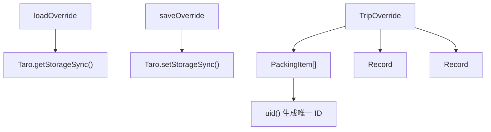
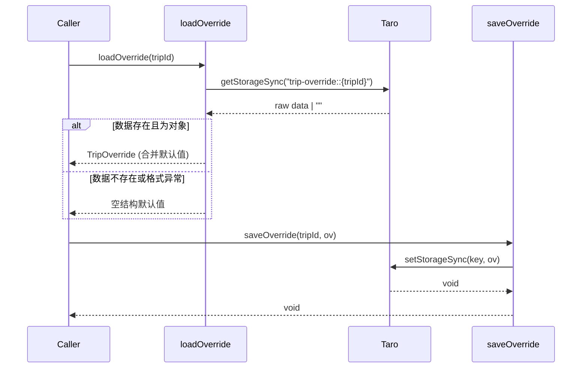
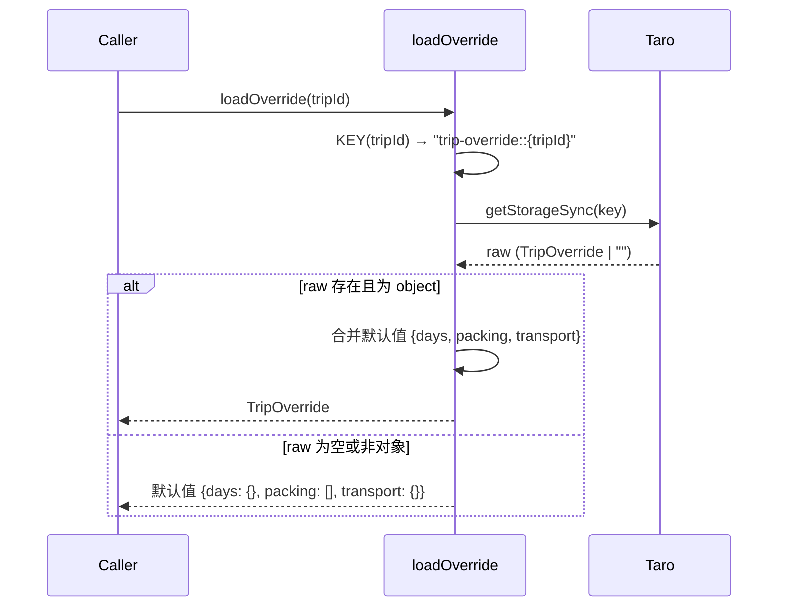
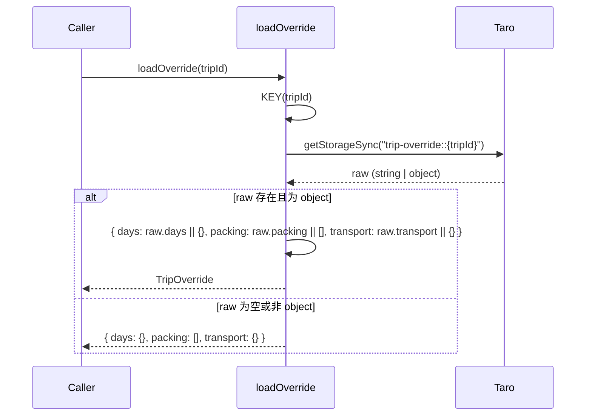
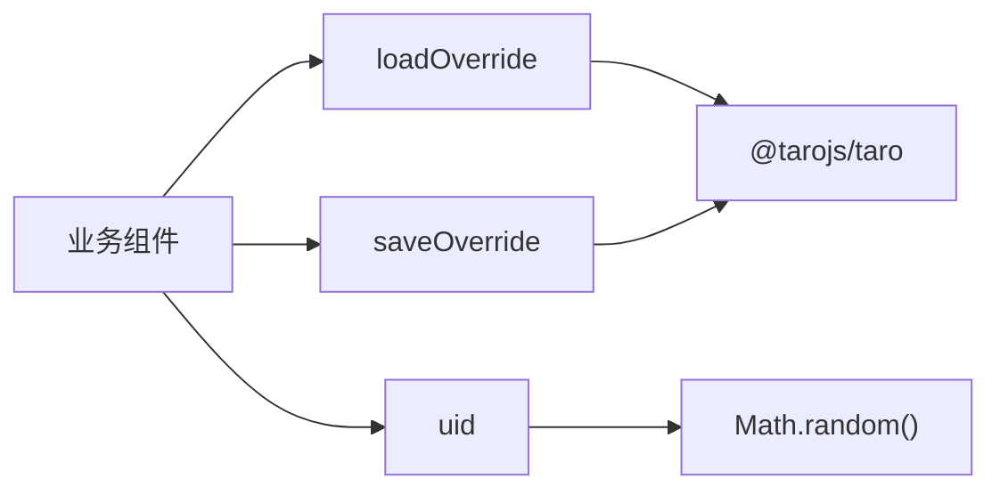

# override-utils spec

> **引用文件**: [override.ts:1-42](../../../src/utils/override.ts#L1-L42)

## 1. 引言

旅行覆盖数据本地存储工具负责管理用户自定义的行程开销调整、打包清单勾选状态和交通费用覆盖。该工具是行册应用的数据持久化层之一，位于业务逻辑层与 Taro 本地存储 API 之间，为行程详情页面提供用户自定义数据的读写能力。

技术选型上，采用 Taro 的 `StorageSync` API 进行同步本地存储，而非异步方案或云端同步。这是因为旅行覆盖数据属于轻量级用户偏好调整（如每日酒店价格微调、打包物品勾选），对实时性要求不高，但需要在页面切换时快速恢复状态。同步 API 简化了调用方的代码逻辑，避免了异步状态管理的复杂度。存储键采用 `trip-override::{tripId}` 命名空间隔离不同行程的数据，避免多行程场景下的数据污染。

> **章节来源**
> - [override.ts:1-42](../../../src/utils/override.ts#L1-L42)

## 2. 项目结构

该能力仅包含单一工具文件，按职责可划分为三个逻辑分组：

- **类型定义** — `src/utils/override.ts` 导出三个 TypeScript 接口：`DayOverride`（单日开销覆盖）、`PackingItem`（打包清单项）、`TripOverride`（完整行程覆盖数据）
- **存储操作** — `src/utils/override.ts` 提供 `loadOverride()` 和 `saveOverride()` 两个函数，封装 Taro 本地存储的读写逻辑
- **辅助工具** — `src/utils/override.ts` 导出 `uid()` 函数，生成随机字符串用于打包清单项的唯一标识

> **图表来源**
> - [override.ts:1-42](../../../src/utils/override.ts#L1-L42)

> **章节来源**
> - [override.ts:1-42](../../../src/utils/override.ts#L1-L42)

## 3. 架构总览

该工具在行册应用中处于数据层底部，直接依赖 Taro 框架提供的本地存储 API。上层业务组件（如行程详情页、打包清单页）通过调用 `loadOverride()` 和 `saveOverride()` 与本地存储交互，无需关心数据序列化或键名拼接细节。

主流程分为两条路径：

**加载流程**：
1. 业务组件调用 `loadOverride(tripId)`
2. 工具函数拼接存储键 `trip-override::{tripId}`
3. 调用 `Taro.getStorageSync()` 读取本地数据
4. 若数据存在且为对象类型，合并默认值后返回 `TripOverride`
5. 若数据不存在或格式异常，返回空结构默认值

**保存流程**：
1. 业务组件调用 `saveOverride(tripId, ov)`
2. 工具函数拼接存储键并调用 `Taro.setStorageSync()` 写入
3. 无返回值，写入失败由 Taro 框架抛出异常

> **图表来源**
> - [override.ts:24-38](../../../src/utils/override.ts#L24-L38)

> **章节来源**
> - [override.ts:1-42](../../../src/utils/override.ts#L1-L42)

## 4. 核心组件

- **DayOverride**：定义单日开销覆盖字段，支持酒店价格、餐饮、门票三项调整。来源：[override.ts:3-7](../../../src/utils/override.ts#L3-L7)
- **PackingItem**：打包清单项数据模型，包含唯一 ID、分类、标签和勾选状态。来源：[override.ts:9-14](../../../src/utils/override.ts#L9-L14)
- **TripOverride**：完整行程覆盖数据聚合，包含每日开销、打包清单和交通费用。来源：[override.ts:16-20](../../../src/utils/override.ts#L16-L20)
- **loadOverride**：从本地存储加载并校验行程覆盖数据。来源：[override.ts:24-34](../../../src/utils/override.ts#L24-L34)
- **saveOverride**：将行程覆盖数据持久化到本地存储。来源：[override.ts:36-38](../../../src/utils/override.ts#L36-L38)
- **uid**：生成 8 位随机字符串作为打包清单项唯一标识。来源：[override.ts:40-42](../../../src/utils/override.ts#L40-L42)

### loadOverride

`loadOverride()` 是数据读取的核心入口。它接收 `tripId` 参数，拼接存储键后调用 `Taro.getStorageSync()` 获取原始数据。设计上采用了防御性编程：当读取到的数据为空字符串（Taro 在键不存在时返回空字符串）或非对象类型时，不直接返回原始值，而是返回一个包含空对象的默认结构 `{ days: {}, packing: [], transport: {} }`。这确保了调用方无需处理 `null` 或 `undefined`，简化了业务逻辑。

关键设计决策：
- 使用 `typeof raw === 'object'` 类型守卫而非直接访问字段，防止脏数据导致运行时错误
- 通过 `raw.days || {}` 等逻辑合并默认值，确保即使存储数据部分缺失也不会引发字段访问异常
- 返回值保证为完整 `TripOverride` 结构，调用方可直接使用而无需额外校验

> **图表来源**
> - [override.ts:24-34](../../../src/utils/override.ts#L24-L34)

### saveOverride

`saveOverride()` 是数据写入的核心入口。它接收 `tripId` 和完整的 `TripOverride` 对象，拼接存储键后调用 `Taro.setStorageSync()` 进行同步写入。设计上采用全量覆盖策略，而非增量更新——每次保存都写入完整的 `TripOverride` 对象。这简化了存储逻辑，避免了合并冲突，但要求调用方在修改前先调用 `loadOverride()` 获取当前数据，在内存中完成修改后再整体写回。

关键设计决策：
- 同步写入（`setStorageSync`）而非异步，确保写入完成后立即返回，调用方无需处理 Promise
- 无返回值，写入失败由 Taro 框架抛出异常，调用方可通过 try-catch 捕获
- 全量覆盖策略简化了数据一致性，但要求调用方遵循"加载-修改-保存"模式

> **图表来源**
> - [override.ts:36-38](../../../src/utils/override.ts#L36-L38)

> **章节来源**
> - [override.ts:1-42](../../../src/utils/override.ts#L1-L42)

## Purpose

提供旅行覆盖数据（用户自定义的行程开销、打包清单勾选状态、交通费用）的本地存储与加载能力，确保用户偏好调整在应用重启后持久化。

> **章节来源**
> - [override.ts:1-42](../../../src/utils/override.ts#L1-L42)

## Requirements

### Requirement: REQ-001 加载行程覆盖数据

系统 SHALL 接收行程 ID，从本地存储中读取对应的覆盖数据并返回结构化的 `TripOverride` 对象。

> **来源**: [override.ts:24-34](../../../src/utils/override.ts#L24-L34)

#### Scenario: 正常加载已有数据

- **GIVEN** 本地存储中存在键 `trip-override::trip-123`，值为 `{ days: { 1: { hotelPrice: 500 } }, packing: [], transport: {} }`
- **WHEN** 调用 `loadOverride("trip-123")`，来源：[override.ts:24](../../../src/utils/override.ts#L24)
- **THEN** 返回 `TripOverride` 对象，其中 `days[1].hotelPrice` 为 500，`packing` 为空数组，`transport` 为空对象

#### Scenario: 加载不存在的行程数据

- **GIVEN** 本地存储中不存在键 `trip-override::trip-new`
- **WHEN** 调用 `loadOverride("trip-new")`，来源：[override.ts:24](../../../src/utils/override.ts#L24)
- **THEN** 返回默认空结构 `{ days: {}, packing: [], transport: {} }`，不抛出异常

#### Scenario: 加载格式异常的脏数据

- **GIVEN** 本地存储中键 `trip-override::trip-corrupt` 的值为非对象类型（如字符串 `"invalid"` 或数字 `123`）
- **WHEN** 调用 `loadOverride("trip-corrupt")`，来源：[override.ts:24](../../../src/utils/override.ts#L24)
- **THEN** 返回默认空结构 `{ days: {}, packing: [], transport: {} }`，不抛出异常

---

### Requirement: REQ-002 保存行程覆盖数据

系统 SHALL 接收行程 ID 和完整的 `TripOverride` 对象，将其持久化到本地存储中。

> **来源**: [override.ts:36-38](../../../src/utils/override.ts#L36-L38)

#### Scenario: 正常保存覆盖数据

- **GIVEN** `tripId` 为 `"trip-456"`，`ov` 为 `{ days: { 2: { meals: 100 } }, packing: [{ id: "abc123", category: "衣物", label: "外套", checked: true }], transport: { taxi: 50 } }`
- **WHEN** 调用 `saveOverride("trip-456", ov)`，来源：[override.ts:36](../../../src/utils/override.ts#L36)
- **THEN** 本地存储中键 `trip-override::trip-456` 的值被更新为该对象，函数无返回值（void）

#### Scenario: 保存空覆盖数据（清空）

- **GIVEN** 先前存在 `trip-override::trip-789` 的数据
- **WHEN** 调用 `saveOverride("trip-789", { days: {}, packing: [], transport: {} })`，来源：[override.ts:36](../../../src/utils/override.ts#L36)
- **THEN** 本地存储中该键的值被覆盖为空结构，先前数据丢失

---

### Requirement: REQ-003 生成打包清单项唯一 ID

系统 SHALL 生成 8 位随机字符串，用于标识打包清单中的每个物品项。

> **来源**: [override.ts:40-42](../../../src/utils/override.ts#L40-L42)

#### Scenario: 正常生成唯一 ID

- **GIVEN** 无特定前置条件
- **WHEN** 调用 `uid()`，来源：[override.ts:40](../../../src/utils/override.ts#L40)
- **THEN** 返回 8 位字母数字组合字符串（如 `"a3f8k2m9"`），基于 `Math.random().toString(36).slice(2, 10)` 生成

#### Scenario: 连续生成不保证全局唯一

- **GIVEN** 无特定前置条件
- **WHEN** 连续调用 `uid()` 两次，来源：[override.ts:40](../../../src/utils/override.ts#L40)
- **THEN** 两次返回值可能相同（极低概率），调用方需在业务层处理 ID 冲突

> **章节来源**
> - [override.ts:1-42](../../../src/utils/override.ts#L1-L42)

## 5. 详细组件分析

### loadOverride 防御性数据加载

`loadOverride()` 的设计核心是"永远返回可用数据"。它通过三层防御机制实现这一点：首先，使用 `Taro.getStorageSync()` 读取原始数据，Taro 在键不存在时返回空字符串而非 `null`；其次，通过 `raw && typeof raw === 'object'` 进行类型守卫，过滤掉空字符串和非对象类型的脏数据；最后，通过 `raw.days || {}` 等逻辑运算符合并默认值，确保即使存储数据中缺失某个字段（如只有 `days` 没有 `packing`），返回值仍然是完整的 `TripOverride` 结构。

这种设计决策的动机在于：旅行覆盖数据是用户偏好调整，丢失部分字段不应导致页面崩溃。调用方（如行程详情页）可以直接使用返回值渲染 UI，无需额外的 null 检查或默认值处理。代价是，当存储数据格式与当前类型定义不一致时（如未来版本新增字段），旧数据不会自动迁移，调用方需要自行处理缺失字段。

> **图表来源**
> - [override.ts:24-34](../../../src/utils/override.ts#L24-L34)

### TripOverride 数据结构设计

`TripOverride` 接口将行程覆盖数据分为三个独立维度：`days`（每日开销覆盖）、`packing`（打包清单）、`transport`（交通费用）。这种分离设计反映了旅行规划的不同阶段：`days` 对应行程中的每日预算调整，`packing` 对应行前准备，`transport` 对应大交通费用（如机票、火车票）。

`days` 使用 `Record<number, DayOverride>` 映射，key 为行程第几天（从 1 开始），value 为该天的覆盖数据。这种设计支持按天精细调整开销，而非全局统一调整。`packing` 使用数组而非映射，因为打包清单需要保持顺序且支持动态增删。`transport` 使用 `Record<string, number>`，key 为交通方式（如 `"flight"`、`"train"`），value 为费用，支持多种交通方式的费用记录。

关键设计决策：
- 所有字段均为可选（`?`），调用方可以只覆盖部分数据而不必提供完整结构
- `uid()` 函数使用 `Math.random().toString(36).slice(2, 10)` 生成 8 位随机字符串，而非 UUID v4，因为打包清单 ID 仅需在单次会话中唯一，无需全局唯一性保证

> **图表来源**
> - [override.ts:3-20](../../../src/utils/override.ts#L3-L20)

> **章节来源**
> - [override.ts:1-42](../../../src/utils/override.ts#L1-L42)

## 6. 依赖关系分析

### 内部依赖

该能力为单一文件工具模块，内部无文件间依赖。类型定义（`DayOverride`、`PackingItem`、`TripOverride`）与函数（`loadOverride`、`saveOverride`、`uid`）共存于同一文件，形成内聚的数据操作单元。无循环依赖。

### 外部依赖

| 依赖 | 用途 | 版本 |
|------|------|------|
| @tarojs/taro | 本地存储 API（getStorageSync、setStorageSync） | 项目依赖版本 |

### 被依赖方

- **业务组件**：行程详情页、打包清单页等调用 `loadOverride()` 和 `saveOverride()` 读写用户偏好数据
- **数据模型**：`TripOverride` 接口被业务组件用作状态管理的数据结构

> **图表来源**
> - [override.ts:1-42](../../../src/utils/override.ts#L1-L42)

> **章节来源**
> - [override.ts:1-42](../../../src/utils/override.ts#L1-L42)

## Open Questions

1. 存储容量限制：Taro 的 `StorageSync` 在不同平台（微信小程序、H5、App）的存储容量上限不同，若用户添加大量打包清单项或超长行程，是否可能触发存储失败？（源码中无容量检查或清理逻辑）
2. 数据迁移策略：若未来版本修改 `TripOverride` 接口结构（如新增字段），旧版本存储的数据如何平滑迁移？（当前 `loadOverride()` 仅对缺失字段提供默认值，不处理字段重命名或删除）
3. `uid()` 的碰撞概率：使用 `Math.random()` 生成的 8 位字符串在大量打包清单项场景下存在碰撞风险，是否应改用更可靠的 UUID 方案？（当前无碰撞检测或重试机制）
4. 多端同步：本地存储数据仅存在于当前设备，若用户更换设备或清理缓存，覆盖数据将丢失。是否考虑未来支持云端同步？（当前架构无此能力）
5. 并发写入安全：若多个组件同时调用 `saveOverride()` 保存同一 `tripId` 的数据，后写入的会覆盖先写入的，是否需要在应用层实现队列或合并逻辑？（当前工具层无并发控制）

> **章节来源**
> - [override.ts:24-42](../../../src/utils/override.ts#L24-L42)
