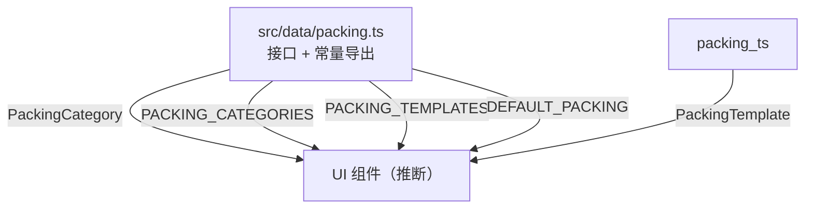
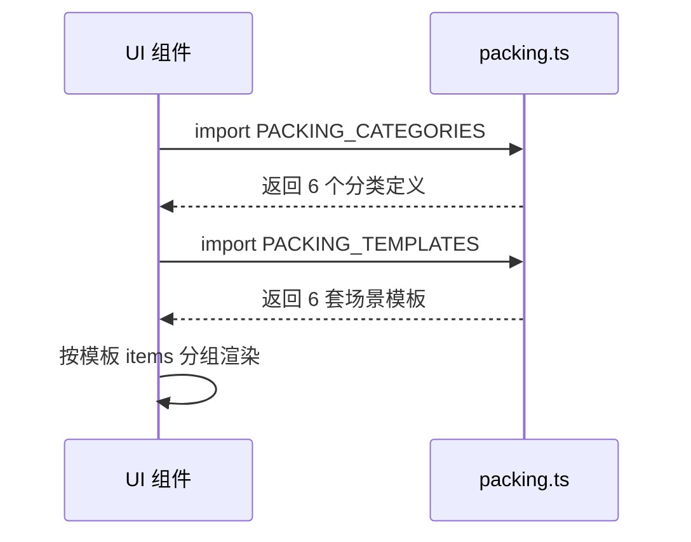
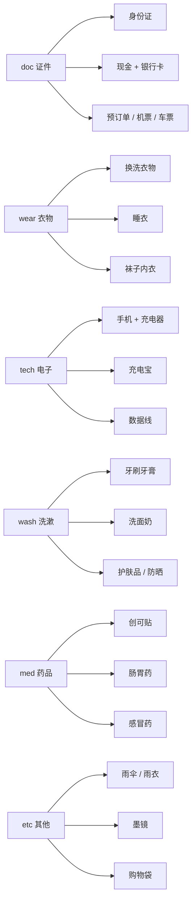
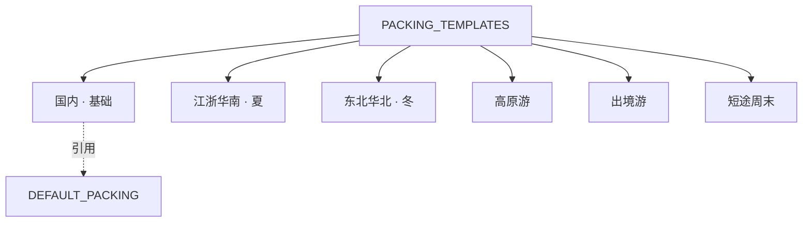
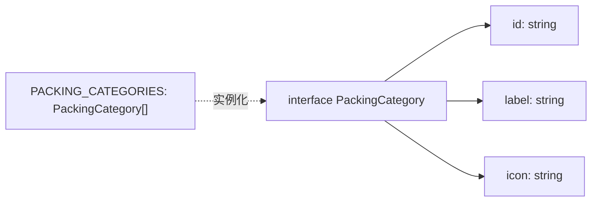
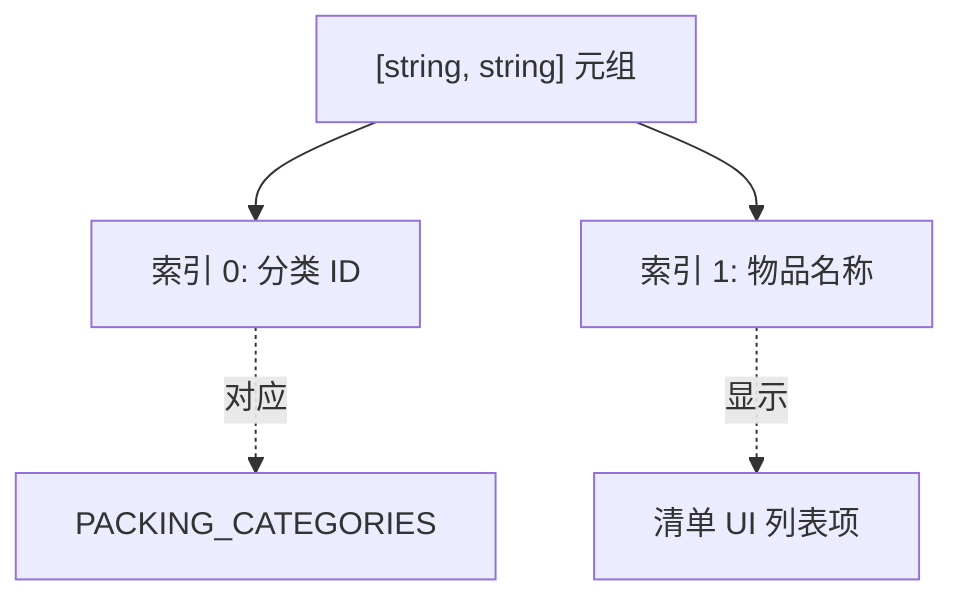
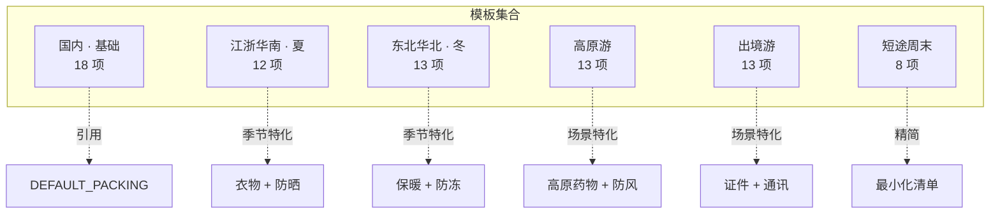
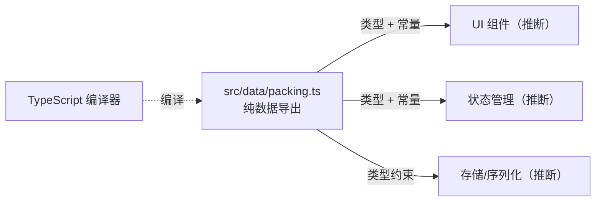

> **引用文件**: [packing.ts:1-86](../../../src/data/packing.ts#L1-L86)

## 1. 引言

行李打包清单模块负责定义打包分类、默认物品列表和多套场景模板，是应用中"行李清单"功能的数据基石。该文件位于项目的 `src/data/` 目录下，作为纯数据层存在，不包含任何业务逻辑或 UI 代码，仅导出 TypeScript 接口和常量供上层组件消费。

技术选型上，采用 `[category_id, item_name]` 的二元组（Tuple）结构表示每个打包项，而非独立对象。这种设计减少了冗余字段（如重复的 `categoryId` key），使数据紧凑且易于序列化为 JSON。分类 ID 与物品名称解耦，同一分类下的物品只需引用分类 ID 即可归类。

> **章节来源**
> - [packing.ts:1-86](../../../src/data/packing.ts#L1-L86)

## 2. 项目结构

该能力仅涉及单个数据定义文件，但在应用中按角色分工如下：

- **数据定义层** — `src/data/packing.ts` 导出所有类型接口（`PackingCategory`、`PackingTemplate`）和常量数据（`PACKING_CATEGORIES`、`DEFAULT_PACKING`、`PACKING_TEMPLATES`），是整个打包清单功能的唯一数据源
- **消费方（推断）** — UI 组件从该文件导入常量和类型，用于渲染分类标签页、模板选择器和物品勾选列表

> **图表来源**
> - [packing.ts:1-86](../../../src/data/packing.ts#L1-L86)

> **章节来源**
> - [packing.ts:1-86](../../../src/data/packing.ts#L1-L86)

## 3. 架构总览

行李打包清单的数据定义位于应用的数据层，是纯静态配置模块。它不依赖任何运行时服务或外部 API，所有数据在编译时即已确定。上层组件通过导入导出的常量和接口来获取分类定义、默认物品列表和场景模板，用于渲染清单界面和初始化用户数据。

主流程：
1. 应用启动时，UI 组件从 `packing.ts` 导入 `PACKING_CATEGORIES` 渲染分类导航
2. 用户选择模板时，组件读取 `PACKING_TEMPLATES` 中对应模板的 `items` 数组
3. 每个物品的元组 `[category_id, item_name]` 被解析后按分类分组展示
4. 用户可在此基础上增删改物品，形成个人清单

> **图表来源**
> - [packing.ts:7-14](../../../src/data/packing.ts#L7-L14)
> - [packing.ts:30-86](../../../src/data/packing.ts#L30-L86)

> **章节来源**
> - [packing.ts:1-86](../../../src/data/packing.ts#L1-L86)

## 4. 核心组件

- **PackingCategory**：分类接口，定义每个打包分类的 ID、显示标签和图标。来源：[packing.ts:1-5](../../../src/data/packing.ts#L1-L5)
- **PACKING_CATEGORIES**：6 个预设分类常量（证件、衣物、电子、洗漱、药品、其他）。来源：[packing.ts:7-14](../../../src/data/packing.ts#L7-L14)
- **PackingTemplate**：模板接口，包含模板名称和物品元组列表。来源：[packing.ts:25-28](../../../src/data/packing.ts#L25-L28)
- **DEFAULT_PACKING**：默认物品列表，覆盖 6 个分类共 18 项基础物品。来源：[packing.ts:16-23](../../../src/data/packing.ts#L16-L23)
- **PACKING_TEMPLATES**：6 套场景模板常量（国内基础、江浙华南夏、东北华北冬、高原游、出境游、短途周末）。来源：[packing.ts:30-86](../../../src/data/packing.ts#L30-L86)

### PACKING_CATEGORIES 与 DEFAULT_PACKING

`PACKING_CATEGORIES` 定义了打包清单的 6 个顶级分类，每个分类由 `id`（唯一标识符）、`label`（中文显示名）和 `icon`（单字符 Unicode 图标）组成。这 6 个分类覆盖了旅行打包的所有常见维度：证件、衣物、电子产品、洗漱用品、药品和其他杂项。

`DEFAULT_PACKING` 使用 `[string, string]` 元组数组的形式，每个元组的第一个元素是分类 ID，第二个元素是物品名称。设计上采用元组而非对象 `{ categoryId, name }`，使数据更紧凑（减少 key 名重复），在序列化/反序列化时占用更少字节。18 项默认物品均匀分布在 6 个分类中，每类 3 项，确保用户首次使用时就有完整的基线清单。

> **图表来源**
> - [packing.ts:7-23](../../../src/data/packing.ts#L7-L23)

### PACKING_TEMPLATES

`PACKING_TEMPLATES` 是模块中信息量最大的数据结构，包含 6 套针对不同旅行场景的预设模板。每套模板是一个 `PackingTemplate` 对象，包含 `name`（模板显示名）和 `items`（物品元组列表）。

关键设计决策：
- **"国内 · 基础"模板**直接引用 `DEFAULT_PACKING` 常量，避免数据重复，确保默认列表修改后基础模板自动同步
- 各场景模板只包含该场景特有的物品，而非全量物品 + 差异化项。这意味着消费方需要自行决定是否将模板物品与用户自定义物品合并
- 物品描述中包含具体数量和使用场景提示（如"短袖 T 恤 ×4"、"一件薄外套（冷气房）"），提升用户可读性

> **图表来源**
> - [packing.ts:30-86](../../../src/data/packing.ts#L30-L86)
> - [packing.ts:16-23](../../../src/data/packing.ts#L16-L23)

> **章节来源**
> - [packing.ts:1-86](../../../src/data/packing.ts#L1-L86)
## Purpose

提供行李打包清单的类型定义、分类体系、默认物品列表和多场景模板数据，供 UI 组件渲染和用户初始化个人清单。

> **章节来源**
> - [packing.ts:1-86](../../../src/data/packing.ts#L1-L86)

## Requirements

### Requirement: REQ-001 分类定义导出

系统 SHALL 导出 `PackingCategory` 接口和 `PACKING_CATEGORIES` 常量，提供 6 个预设打包分类的完整定义。

> **来源**: [packing.ts:1-14](../../../src/data/packing.ts#L1-L14)

#### Scenario: 获取分类列表

- **GIVEN** 消费方导入 `PACKING_CATEGORIES`
- **WHEN** 读取该常量，来源：[packing.ts:7](../../../src/data/packing.ts#L7)
- **THEN** 返回包含 6 个 `PackingCategory` 对象的数组，每个对象具有 `id`（string）、`label`（string）、`icon`（string）三个字段

#### Scenario: 分类 ID 唯一性

- **GIVEN** `PACKING_CATEGORIES` 中的 6 个分类
- **WHEN** 检查所有 `id` 字段，来源：[packing.ts:8-13](../../../src/data/packing.ts#L8-L13)
- **THEN** 所有 `id` 值互不相同，分别为 `'doc'`、`'wear'`、`'tech'`、`'wash'`、`'med'`、`'etc'`

---

### Requirement: REQ-002 默认物品列表

系统 SHALL 导出 `DEFAULT_PACKING` 常量，提供覆盖全部 6 个分类的 18 项基础打包物品。

> **来源**: [packing.ts:16-23](../../../src/data/packing.ts#L16-L23)

#### Scenario: 默认物品覆盖所有分类

- **GIVEN** 消费方导入 `DEFAULT_PACKING`
- **WHEN** 遍历所有元组的第一个元素（分类 ID），来源：[packing.ts:16-22](../../../src/data/packing.ts#L16-L22)
- **THEN** 出现且仅出现 `'doc'`、`'wear'`、`'tech'`、`'wash'`、`'med'`、`'etc'` 各 3 次

#### Scenario: 元组格式正确

- **GIVEN** `DEFAULT_PACKING` 中的每个元素
- **WHEN** 检查元素类型，来源：[packing.ts:17](../../../src/data/packing.ts#L17)
- **THEN** 每个元素为长度为 2 的元组 `[string, string]`，第一个元素为有效分类 ID，第二个元素为非空物品名称

---

### Requirement: REQ-003 模板接口定义

系统 SHALL 导出 `PackingTemplate` 接口，定义模板数据结构的类型约束。

> **来源**: [packing.ts:25-28](../../../src/data/packing.ts#L25-L28)

#### Scenario: 模板结构校验

- **GIVEN** 消费方使用 `PackingTemplate` 接口
- **WHEN** 检查接口定义，来源：[packing.ts:25-28](../../../src/data/packing.ts#L25-L28)
- **THEN** 接口包含 `name: string` 和 `items: Array<[string, string]>` 两个字段

#### Scenario: 模板 items 格式

- **GIVEN** 任意 `PackingTemplate` 实例
- **WHEN** 访问其 `items` 字段
- **THEN** 返回值为 `[string, string]` 元组数组，格式与 `DEFAULT_PACKING` 一致

---

### Requirement: REQ-004 场景模板导出

系统 SHALL 导出 `PACKING_TEMPLATES` 常量，提供 6 套针对不同旅行场景的预设打包模板。

> **来源**: [packing.ts:30-86](../../../src/data/packing.ts#L30-L86)

#### Scenario: 获取模板列表

- **GIVEN** 消费方导入 `PACKING_TEMPLATES`
- **WHEN** 读取该常量，来源：[packing.ts:30](../../../src/data/packing.ts#L30)
- **THEN** 返回包含 6 个 `PackingTemplate` 对象的数组，模板名分别为：'国内 · 基础'、'江浙华南 · 夏'、'东北华北 · 冬'、'高原游'、'出境游'、'短途周末'

#### Scenario: 基础模板引用默认列表

- **GIVEN** '国内 · 基础' 模板
- **WHEN** 访问其 `items` 字段，来源：[packing.ts:32-34](../../../src/data/packing.ts#L32-L34)
- **THEN** `items` 直接引用 `DEFAULT_PACKING` 常量（同一对象引用，非副本）

#### Scenario: 场景模板物品数量合理

- **GIVEN** 各场景模板的 `items` 数组
- **WHEN** 检查每个模板的物品数量，来源：[packing.ts:37-85](../../../src/data/packing.ts#L37-L85)
- **THEN** '江浙华南 · 夏' 含 12 项、'东北华北 · 冬' 含 13 项、'高原游' 含 13 项、'出境游' 含 13 项、'短途周末' 含 8 项，各项数量符合场景复杂度

---

### Requirement: REQ-005 分类 ID 与物品关联

系统 SHALL 确保每个打包物品的元组中，第一个元素（分类 ID）与 `PACKING_CATEGORIES` 中定义的某个 `id` 匹配。

> **来源**: [packing.ts:7-14](../../../src/data/packing.ts#L7-L14), [packing.ts:16-23](../../../src/data/packing.ts#L16-L23)

#### Scenario: 默认物品分类 ID 有效

- **GIVEN** `DEFAULT_PACKING` 中的所有元组
- **WHEN** 提取每个元组的第一个元素并对照 `PACKING_CATEGORIES` 的 `id` 集合，来源：[packing.ts:17-22](../../../src/data/packing.ts#L17-L22)
- **THEN** 所有分类 ID 均在 `PACKING_CATEGORIES` 中存在，无无效 ID

#### Scenario: 模板物品分类 ID 有效

- **GIVEN** `PACKING_TEMPLATES` 中所有模板的所有物品
- **WHEN** 提取每个元组的第一个元素并对照 `PACKING_CATEGORIES` 的 `id` 集合，来源：[packing.ts:37-85](../../../src/data/packing.ts#L37-L85)
- **THEN** 所有分类 ID 均在 `PACKING_CATEGORIES` 中存在，无无效 ID

> **章节来源**
> - [packing.ts:1-86](../../../src/data/packing.ts#L1-L86)
## 5. 详细组件分析

### PackingCategory 接口与 PACKING_CATEGORIES

`PackingCategory` 接口（3 字段：`id`、`label`、`icon`）是整个分类体系的基础类型。设计上将分类的显示信息（label、icon）与逻辑标识（id）分离，使得 UI 层可以自由定制显示样式而无需修改业务逻辑。`id` 字段采用简短英文缩写（如 `'doc'`、`'wear'`），在存储和传输时节省空间；`label` 使用中文全称便于用户阅读；`icon` 使用单字符 Unicode 符号（如 `'◇'`、`'◆'`），避免引入外部图标库依赖。

`PACKING_CATEGORIES` 数组按逻辑顺序排列：证件 → 衣物 → 电子 → 洗漱 → 药品 → 其他。这个顺序反映了旅行打包的优先级——证件最重要，其他杂项最后考虑。

> **图表来源**
> - [packing.ts:1-14](../../../src/data/packing.ts#L1-L14)

### 元组数据结构 [string, string]

模块中所有物品列表（`DEFAULT_PACKING` 和各模板的 `items`）统一采用 `[string, string]` 元组而非对象。这一设计决策有几个考量：

1. **紧凑性**：元组在 JSON 序列化时为 `["doc", "身份证"]`，而对象为 `{"categoryId":"doc","name":"身份证"}`，前者减少约 30% 的字符数，对移动端存储和传输更友好
2. **类型安全**：TypeScript 的 `Array<[string, string]>` 类型约束确保每个元素必须是二元组，编译时即可发现格式错误
3. **解耦设计**：分类 ID 与物品名称独立存在，同一个分类 ID 可复用多次，无需担心对象结构变更

潜在风险：元组缺乏自描述性，消费方需要查阅文档或类型定义才能理解 `[0]` 是分类 ID、`[1]` 是物品名称。建议在消费方代码中通过解构赋值 `const [categoryId, itemName] = item` 提升可读性。

> **图表来源**
> - [packing.ts:16-23](../../../src/data/packing.ts#L16-L23)
> - [packing.ts:25-28](../../../src/data/packing.ts#L25-L28)

### PACKING_TEMPLATES 场景化设计

`PACKING_TEMPLATES` 包含 6 套模板，覆盖了中国境内不同地域/季节和出境游的典型场景。模板设计的核心思路是"场景特化"而非"增量差异"——每套模板只包含该场景下需要的物品，不包含通用物品。这意味着消费方在应用模板时，可能需要将模板物品与用户已有物品合并，或直接替换。

特殊处理：
- **"国内 · 基础"模板**通过 `items: DEFAULT_PACKING` 直接引用，而非复制数组内容。这一引用关系保证了默认列表的修改会自动反映到基础模板中
- **出境游模板**特别强调证件类物品（7 项，占模板总物品的半数以上），包括护照、签证、旅行保险等，体现了出境游对文件完备性的高要求
- **高原游模板**药品类物品占比最高（6 项），包含红景天、葡萄糖、氧气罐等高原特需药物

> **图表来源**
> - [packing.ts:30-86](../../../src/data/packing.ts#L30-L86)

> **章节来源**
> - [packing.ts:1-86](../../../src/data/packing.ts#L1-L86)

## 6. 依赖关系分析

### 内部依赖

该能力仅包含单个文件 `src/data/packing.ts`，无内部文件间依赖。文件内部存在常量间的引用关系：`PACKING_TEMPLATES[0].items` 引用 `DEFAULT_PACKING`，形成单向数据流。

### 外部依赖

该模块为纯 TypeScript 数据定义文件，不依赖任何第三方库（如 lodash、dayjs 等）。仅依赖 TypeScript 编译器和运行时环境。类型定义（`PackingCategory`、`PackingTemplate`）为编译时约束，运行时不产生额外开销。

### 被依赖方（推断）

- **UI 组件层**：预计有 React/Vue 组件导入本模块的常量和类型，用于渲染分类导航、模板选择器和物品列表
- **状态管理层**：可能有 Redux/Pinia 等状态管理模块导入本模块，用于初始化用户清单的默认状态
- **序列化/存储层**：用户清单持久化时可能需要验证物品格式是否符合 `PackingTemplate` 接口

### 循环依赖

无循环依赖。该文件为叶节点模块，只导出数据，不导入项目内其他模块。

> **图表来源**
> - [packing.ts:1-86](../../../src/data/packing.ts#L1-L86)

> **章节来源**
> - [packing.ts:1-86](../../../src/data/packing.ts#L1-L86)

## Open Questions

1. 模板物品是否为全量列表还是增量列表？源码中各场景模板只包含特定物品，未明确消费方是否需要将模板物品与 `DEFAULT_PACKING` 合并使用
2. 物品元组中是否允许重复的 `[categoryId, itemName]` 组合？源码中无去重逻辑，也未定义重复项的处理策略
3. 分类的 `icon` 字段使用 Unicode 单字符符号，是否支持自定义图标（如 emoji 或 SVG 图标）？类型定义为 `string`，理论上支持但未见相关文档
4. 是否支持运行时动态添加新分类或新模板？当前所有数据为编译时常量，未提供扩展机制
5. 物品名称中的数量描述（如"×4"）和使用场景提示（如"（冷气房）"）是否应由 UI 层单独解析，还是仅作为显示文本？

> **章节来源**
> - [packing.ts:1-86](../../../src/data/packing.ts#L1-L86)
