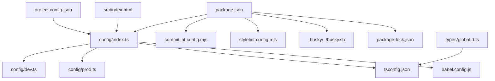
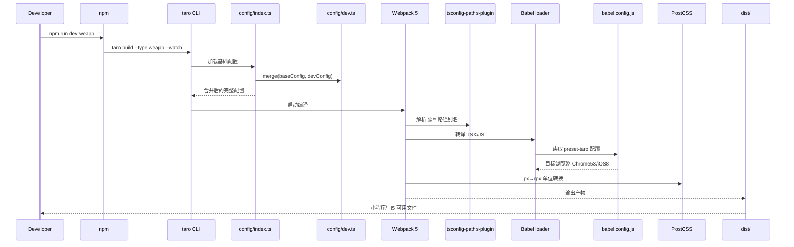
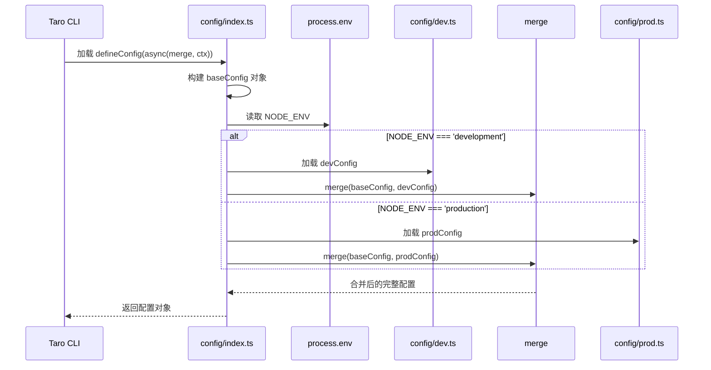
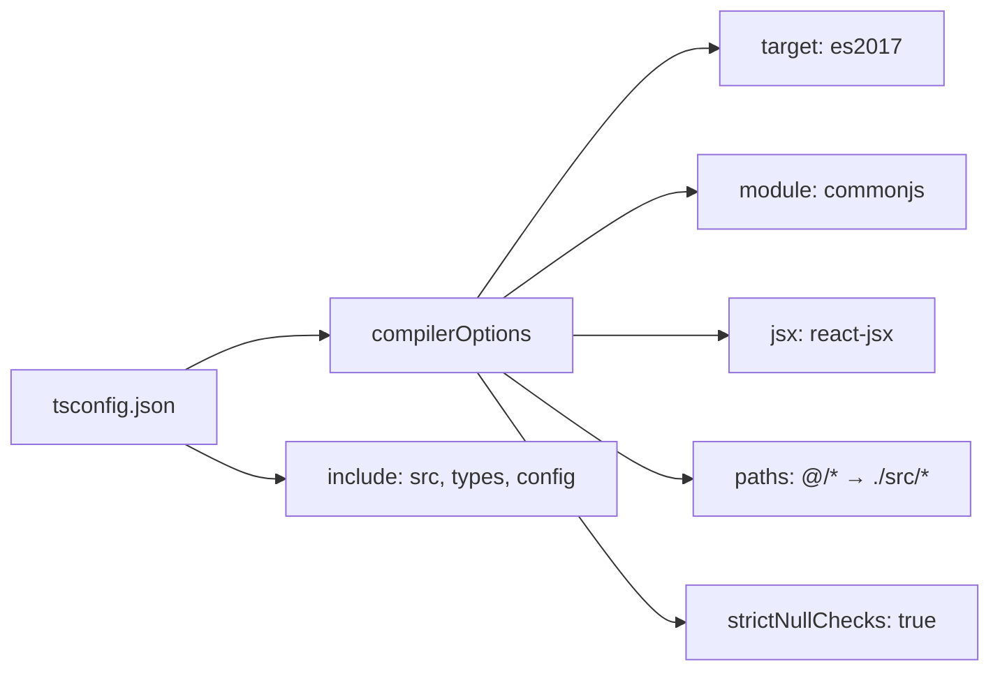
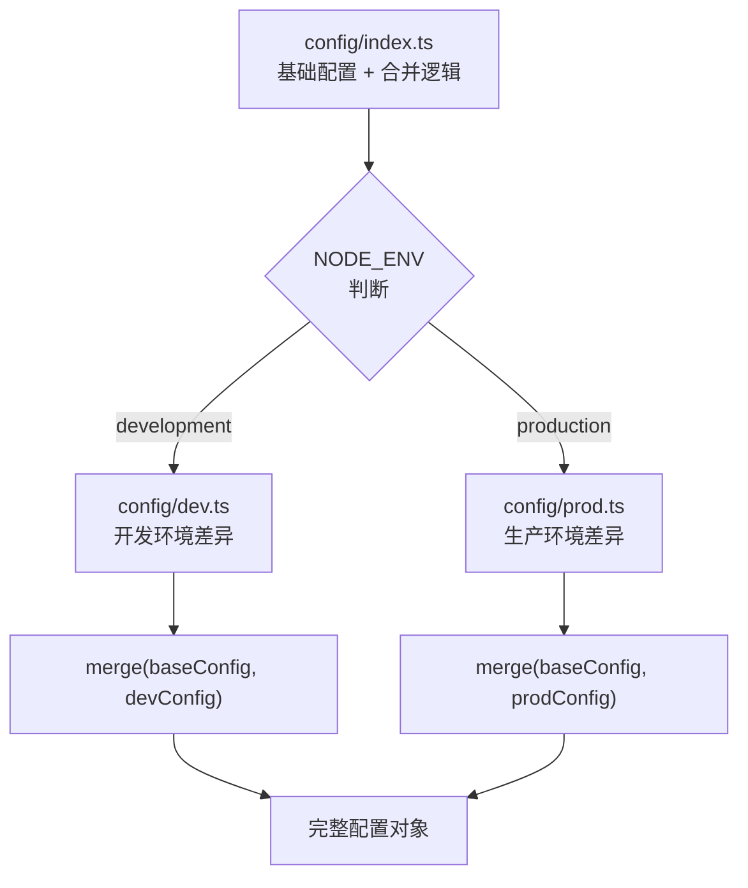
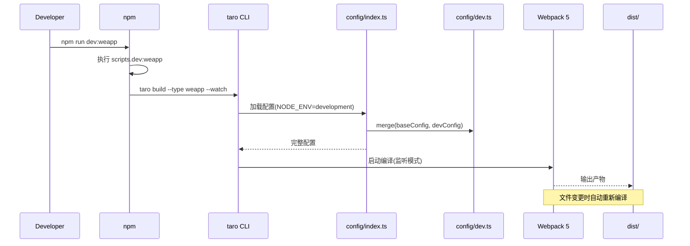
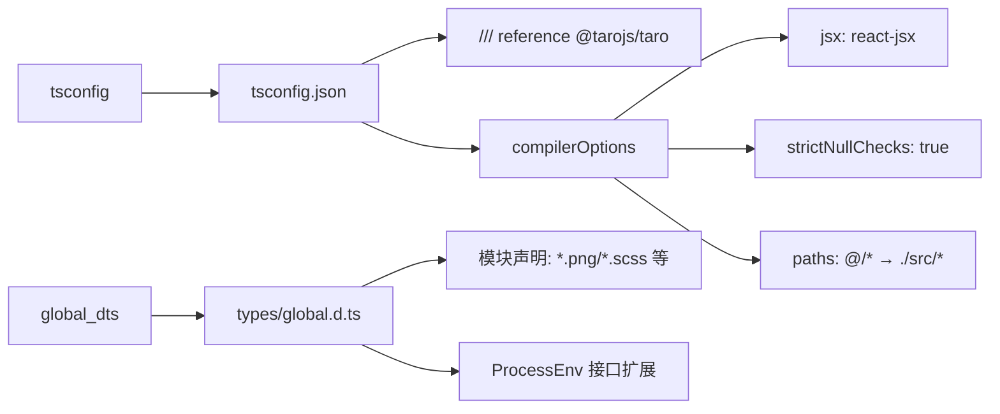
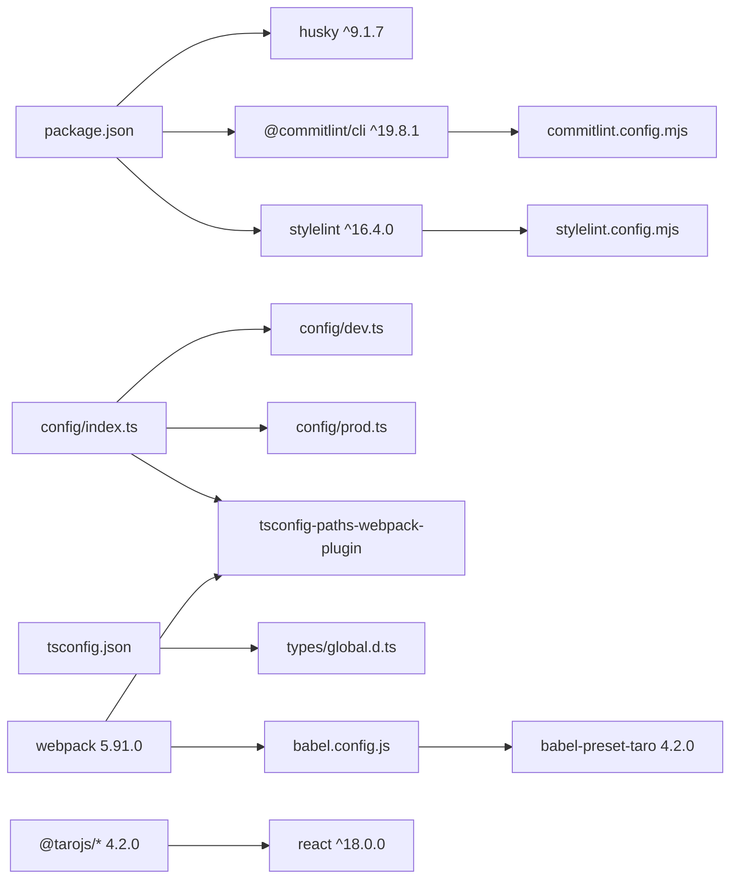

> **引用文件**: [babel.config.js:1-15](../../../babel.config.js#L1-L15), [commitlint.config.mjs:1-1](../../../commitlint.config.mjs#L1-L1), [config/dev.ts:1-10](../../../config/dev.ts#L1-L10), [config/index.ts:1-102](../../../config/index.ts#L1-L102), [config/prod.ts:1-33](../../../config/prod.ts#L1-L33), [package-lock.json:1-80](../../../package-lock.json#L1-L80), [package.json:1-90](../../../package.json#L1-L90), [project.config.json:1-15](../../../project.config.json#L1-L15), [src/index.html:1-17](../../../src/index.html#L1-L17), [stylelint.config.mjs:1-4](../../../stylelint.config.mjs#L1-L4), [tsconfig.json:1-30](../../../tsconfig.json#L1-L29), [types/global.d.ts:1-29](../../../types/global.d.ts#L1-L29)

## 1. 引言

项目构建配置能力为「行册」应用提供完整的开发工具链、多端构建流程和环境变量管理体系。该能力位于项目的根目录配置层，是所有开发、构建、部署流程的入口。技术选型上，采用 Taro 4.2.0 框架实现一套代码多端运行（微信小程序、H5、支付宝小程序等），使用 Webpack 5 作为模块打包工具，TypeScript 5.4 提供类型安全，配合 Husky + Commitlint 实现 Git 提交规范，Stylelint 保障样式代码质量。

构建流程：开发者通过 `npm run dev:{platform}` 启动本地开发服务器，Taro CLI 根据 `config/index.ts` 中的基础配置与 `config/dev.ts` 的开发配置合并后调用 Webpack 进行编译；生产环境通过 `npm run build:{platform}` 触发，此时合并 `config/prod.ts` 的生产优化配置（压缩、代码分割等）。整个流程通过 `NODE_ENV` 环境变量区分开发与生产模式。

> **章节来源**
> - [package.json:12-32](../../../package.json#L12-L32)
> - [config/index.ts:1-102](../../../config/index.ts#L1-L102)
> - [config/dev.ts:1-10](../../../config/dev.ts#L1-L10)
> - [config/prod.ts:1-33](../../../config/prod.ts#L1-L33)

## 2. 项目结构

按角色分组描述相关文件的组织方式：

- **核心构建配置** — `config/index.ts` 定义 Taro 项目的基础构建参数（设计稿宽度、源码目录、输出目录、框架类型、编译器选择等），并根据 `NODE_ENV` 动态合并开发或生产配置
- **环境差异化配置** — `config/dev.ts` 配置开发环境特有的日志输出；`config/prod.ts` 预留生产环境的 Webpack 优化插件入口（如包体积分析、SSR 预渲染）
- **包管理与脚本入口** — `package.json` 定义多端构建脚本（`dev:weapp`、`build:h5` 等）、依赖版本约束和 browserslist 目标兼容性
- **依赖锁定** — `package-lock.json` 锁定整个依赖树的精确版本，确保跨机器安装的一致性
- **TypeScript 编译配置** — `tsconfig.json` 设置目标 ES2017、模块系统 CommonJS、JSX 转换 react-jsx、路径别名 `@/*` 映射到 `./src/*`
- **Babel 转译配置** — `babel.config.js` 使用 `babel-preset-taro` 预设，针对 Chrome 53 / iOS 8 做语法降级
- **代码质量工具** — `commitlint.config.mjs` 继承 Conventional Commits 规范；`stylelint.config.mjs` 继承 standard 规则集校验样式代码
- **Git Hooks** — `.husky/_/husky.sh` 是 Husky v9 的内置脚本，配合 `package.json` 中的 `prepare` 脚本自动安装 Git 钩子
- **微信小程序项目配置** — `project.config.json` 声明小程序 appid、编译后产物目录 `./dist`、开发者工具设置
- **H5 入口模板** — `src/index.html` 是 H5 端的 HTML 模板，包含 viewport 适配、iOS PWA 支持和动态 script 注入
- **全局类型声明** — `types/global.d.ts` 声明静态资源模块导入（图片、样式文件）和 NodeJS 进程环境变量类型（`NODE_ENV`、`TARO_ENV`、`TARO_APP_ID`）

> **图表来源**
> - [package.json:12-32](../../../package.json#L12-L32)
> - [config/index.ts:1-102](../../../config/index.ts#L1-L102)
> - [config/dev.ts:1-10](../../../config/dev.ts#L1-L10)
> - [config/prod.ts:1-33](../../../config/prod.ts#L1-L33)
> - [tsconfig.json:1-30](../../../tsconfig.json#L1-L29)
> - [babel.config.js:1-15](../../../babel.config.js#L1-L15)

> **章节来源**
> - [package.json:1-90](../../../package.json#L1-L90)
> - [config/index.ts:1-102](../../../config/index.ts#L1-L102)
> - [tsconfig.json:1-30](../../../tsconfig.json#L1-L29)
> - [babel.config.js:1-15](../../../babel.config.js#L1-L15)

## 3. 架构总览

项目构建配置能力处于整个应用开发流程的最底层，为源码编写、代码提交、多端构建三个环节提供工具支撑。Taro CLI 作为构建编排器，读取 `config/index.ts` 中的基础配置后根据 `NODE_ENV` 选择合并 `dev.ts` 或 `prod.ts`，再调用 Webpack 5 执行模块打包。TypeScript 编译器通过 `tsconfig.json` 的路径别名和类型检查介入编译流程；Babel 在 Webpack 的 loader 链中对 JS/TSX 做语法降级和框架转换。

主流程：
1. 开发者执行 `npm run dev:weapp` 或 `npm run build:h5` 等脚本
2. npm 调用 `taro build --type {platform} --watch`（dev 模式带 watch）
3. Taro CLI 加载 `config/index.ts`，根据 `NODE_ENV` 调用 `merge(baseConfig, devConfig)` 或 `merge(baseConfig, prodConfig)`
4. Webpack 5 接收合并后的配置，通过 `tsconfig-paths-webpack-plugin` 解析 `@/*` 路径别名
5. Babel loader 使用 `babel-preset-taro` 转译源码，PostCSS 处理 px→rpx 单位转换
6. 产物输出到 `dist/` 目录，微信小程序端同时生成 `project.config.json` 供开发者工具使用

> **图表来源**
> - [package.json:24](../../../package.json#L24)
> - [config/index.ts:96-102](../../../config/index.ts#L96-L102)
> - [config/index.ts:52-54](../../../config/index.ts#L52-L54)
> - [babel.config.js:1-15](../../../babel.config.js#L1-L15)

> **章节来源**
> - [package.json:12-32](../../../package.json#L12-L32)
> - [config/index.ts:1-102](../../../config/index.ts#L1-L102)
> - [config/dev.ts:1-10](../../../config/dev.ts#L1-L10)
> - [config/prod.ts:1-33](../../../config/prod.ts#L1-L33)

## 4. 核心组件

关键组件列举：

- **Taro 构建配置导出**：通过 `defineConfig` 辅助函数定义项目级构建参数，支持 async 合并逻辑。来源：[config/index.ts:7](../../../config/index.ts#L7)
- **环境配置模块**：`dev.ts` 和 `prod.ts` 分别提供开发和生产环境的差异化配置项。来源：[config/dev.ts:3](../../../config/dev.ts#L3)、[config/prod.ts:3](../../../config/prod.ts#L3)
- **npm 构建脚本**：`package.json` 中定义了 18 个跨平台构建脚本，覆盖微信小程序、H5、React Native 等 9 个目标平台。来源：[package.json:12-32](../../../package.json#L12-L32)
- **TypeScript 编译配置**：设置目标语言级别、模块系统、路径别名和严格模式。来源：[tsconfig.json:1-30](../../../tsconfig.json#L1-L29)
- **Babel 转译预设**：通过 `babel-preset-taro` 实现 React JSX 转换和语法降级。来源：[babel.config.js:3-15](../../../babel.config.js#L3-L15)
- **代码质量工具链**：Commitlint 校验提交信息格式，Stylelint 校验样式规范，Husky 绑定 Git 钩子。来源：[commitlint.config.mjs:1](../../../commitlint.config.mjs#L1)、[stylelint.config.mjs:2-4](../../../stylelint.config.mjs#L2-L4)

### Taro 构建配置导出（config/index.ts）

`config/index.ts` 是整个构建配置的核心入口。它使用 Taro 提供的 `defineConfig` 辅助函数导出一个 async 函数，该函数接收 `merge` 工具和 `{ command, mode }` 上下文参数，返回合并后的完整配置对象。

设计上采用"基础配置 + 环境配置"的分层合并策略：`baseConfig` 包含所有平台共有的配置项（设计稿宽度 750、源码目录 `src`、输出目录 `dist`、React 框架、Webpack 5 编译器），而 `devConfig` 和 `prodConfig` 仅包含环境差异项。通过 `process.env.NODE_ENV` 判断当前环境，使用 `merge()` 深度合并后返回。这种设计避免了开发/生产配置中的重复项，也便于后续新增环境（如 staging）。

关键设计决策：
- **Webpack 持久化缓存默认关闭**：注释中建议开启，但当前设为 `false`，可能是为了避免初次构建的缓存异常问题
- **CSS Modules 默认禁用**：`mini.cssModules.enable` 和 `h5.cssModules.enable` 均为 `false`，项目选择全局样式方案而非 CSS Modules
- **tsconfig-paths 双端注入**：在 `mini.webpackChain` 和 `h5.webpackChain` 中均注入 `TsconfigPathsPlugin`，确保小程序端和 H5 端都能解析 `@/*` 别名

> **图表来源**
> - [config/index.ts:7-102](../../../config/index.ts#L7-L102)
> - [config/dev.ts:3-10](../../../config/dev.ts#L3-L10)
> - [config/prod.ts:3-33](../../../config/prod.ts#L3-L33)

### TypeScript 编译配置（tsconfig.json）

`tsconfig.json` 定义了 TypeScript 编译器的行为。目标语言级别设为 ES2017（支持 async/await、Object.values 等现代 API），模块系统使用 CommonJS（适配 Node.js 环境和 Taro 的模块加载机制），JSX 转换为 `react-jsx`（React 17+ 的新 JSX 转换，无需显式导入 React）。

路径别名 `@/*` 映射到 `./src/*` 是项目中最常用的导入简写，配合 `tsconfig-paths-webpack-plugin` 在 Webpack 编译期生效。`strictNullChecks: true` 启用空值检查，但 `noImplicitAny: false` 允许隐式 any 类型——这是一个务实的取舍，在迁移到 TypeScript 初期减少报错。

> **图表来源**
> - [tsconfig.json:2-26](../../../tsconfig.json#L2-L26)
> - [tsconfig.json:28](../../../tsconfig.json#L28)

> **章节来源**
> - [config/index.ts:1-102](../../../config/index.ts#L1-L102)
> - [tsconfig.json:1-30](../../../tsconfig.json#L1-L29)
> - [babel.config.js:1-15](../../../babel.config.js#L1-L15)
> - [package.json:12-32](../../../package.json#L12-L32)
## Purpose

提供 Taro 多端项目的构建配置、开发工具链集成和环境变量管理能力，使一套 React + TypeScript 源码可编译输出到微信小程序、H5、支付宝小程序等 9 个目标平台。

> **章节来源**
> - [package.json:5](../../../package.json#L5)
> - [config/index.ts:8-92](../../../config/index.ts#L8-L92)

## Requirements

### Requirement: REQ-001 多端构建脚本执行

系统 SHALL 提供 18 个 npm 脚本，覆盖 9 个目标平台（weapp、swan、alipay、tt、h5、rn、qq、jd、harmony-hybrid）的开发（dev）和构建（build）模式。

> **来源**: [package.json:12-32](../../../package.json#L12-L32)

#### Scenario: 执行微信小程序开发模式

- **GIVEN** 当前环境已安装 Node.js 和项目依赖（`node_modules` 存在）
- **WHEN** 执行 `npm run dev:weapp`，来源：[package.json:24](../../../package.json#L24)
- **THEN** 实际调用 `taro build --type weapp --watch`，启动 Webpack 监听模式，源码变更后自动重新编译，产物输出到 `dist/` 目录

#### Scenario: 执行 H5 生产构建

- **GIVEN** 当前代码已提交且无 TypeScript 编译错误
- **WHEN** 执行 `npm run build:h5`，来源：[package.json:19](../../../package.json#L19)
- **THEN** 实际调用 `taro build --type h5`，Webpack 以生产模式编译（压缩、代码分割），产物输出到 `dist/`，输出文件名格式为 `js/[name].[hash:8].js`

#### Scenario: 执行不支持的平台

- **GIVEN** 执行 `npm run build:xxx`（xxx 不在 9 个支持的平台列表中）
- **WHEN** 调用 `taro build --type xxx`
- **THEN** Taro CLI 抛出错误，提示不支持的目标平台

---

### Requirement: REQ-002 环境配置动态合并

系统 SHALL 根据 `NODE_ENV` 环境变量的值（`development` 或 `production`）动态合并不同的环境配置到基础配置中。

> **来源**: [config/index.ts:96-102](../../../config/index.ts#L96-L102)

#### Scenario: 开发环境配置合并

- **GIVEN** `NODE_ENV` 设为 `development`（通过 `dev:*` 脚本自动设置）
- **WHEN** Taro CLI 加载 `config/index.ts`，来源：[config/index.ts:96](../../../config/index.ts#L96)
- **THEN** 返回 `merge({}, baseConfig, devConfig)`，其中 `devConfig` 包含 `logger: { quiet: false, stats: true }`，编译输出详细的日志和统计信息

#### Scenario: 生产环境配置合并

- **GIVEN** `NODE_ENV` 设为 `production`（通过 `build:*` 脚本自动设置）
- **WHEN** Taro CLI 加载 `config/index.ts`，来源：[config/index.ts:101](../../../config/index.ts#L101)
- **THEN** 返回 `merge({}, baseConfig, prodConfig)`，其中 `prodConfig` 为空对象但预留了 Webpack 优化插件的注释入口，Taro 默认启用生产优化（压缩、Tree Shaking）

---

### Requirement: REQ-003 TypeScript 路径别名解析

系统 SHALL 支持通过 `@/*` 路径别名引用 `src/` 目录下的任意模块，且在 TypeScript 编译和 Webpack 打包时均可正确解析。

> **来源**: [tsconfig.json:23-26](../../../tsconfig.json#L23-L26)、[config/index.ts:52-54](../../../config/index.ts#L52-L54)

#### Scenario: 源码中使用路径别名

- **GIVEN** 源文件 `src/pages/index/index.tsx` 中包含 `import { Header } from '@/components/Header'`
- **WHEN** TypeScript 编译器检查类型，来源：[tsconfig.json:25](../../../tsconfig.json#L25)
- **THEN** 解析为 `src/components/Header` 下的对应文件（`.ts`/`.tsx`/`.js`），类型检查通过

#### Scenario: Webpack 编译时解析别名

- **GIVEN** 同上源码
- **WHEN** Webpack 通过 `tsconfig-paths-webpack-plugin` 处理模块解析，来源：[config/index.ts:53](../../../config/index.ts#L53)
- **THEN** 别名正确解析为 `./src/components/Header`，打包产物中包含该模块

#### Scenario: 别名指向不存在的文件

- **GIVEN** 源码中包含 `import { Foo } from '@/non-existent'`
- **WHEN** TypeScript 编译器检查类型
- **THEN** 抛出 TS2307 错误 "Cannot find module '@/non-existent'"

---

### Requirement: REQ-004 代码提交规范校验

系统 SHALL 在 Git commit 时通过 Husky + Commitlint 校验提交信息格式，确保符合 Conventional Commits 规范。

> **来源**: [package.json:13](../../../package.json#L13)、[commitlint.config.mjs:1](../../../commitlint.config.mjs#L1)

#### Scenario: 符合规范的提交信息

- **GIVEN** 开发者执行 `git commit -m "feat: add weather page"`
- **WHEN** Husky 触发 `commit-msg` 钩子，调用 Commitlint 校验，来源：[commitlint.config.mjs:1](../../../commitlint.config.mjs#L1)
- **THEN** 提交信息通过校验（符合 `type: subject` 格式），commit 成功

#### Scenario: 不符合规范的提交信息

- **GIVEN** 开发者执行 `git commit -m "update stuff"`
- **WHEN** Commitlint 校验提交信息，来源：[commitlint.config.mjs:1](../../../commitlint.config.mjs#L1)
- **THEN** 校验失败（缺少 Conventional Commits 的 type 前缀），commit 被拒绝，输出错误提示

---

### Requirement: REQ-005 样式代码规范校验

系统 SHALL 通过 Stylelint 校验项目中的样式文件（SCSS/CSS），确保符合标准样式规范。

> **来源**: [stylelint.config.mjs:2-4](../../../stylelint.config.mjs#L2-L4)

#### Scenario: 符合规范样式文件

- **GIVEN** SCSS 文件使用标准属性顺序、无重复属性、使用双引号
- **WHEN** Stylelint 扫描该文件，来源：[stylelint.config.mjs:3](../../../stylelint.config.mjs#L3)
- **THEN** 无错误输出，校验通过

#### Scenario: 违反规范的样式文件

- **GIVEN** SCSS 文件中存在重复属性或使用单引号
- **WHEN** Stylelint 扫描该文件，来源：[stylelint.config.mjs:3](../../../stylelint.config.mjs#L3)
- **THEN** 输出警告或错误，指出违规规则名称和行号

---

### Requirement: REQ-006 H5 端 HTML 模板注入

系统 SHALL 在 H5 端构建时将 `src/index.html` 作为 HTML 模板，注入 Webpack 打包后的 JS/CSS 资源和平台适配 script。

> **来源**: [src/index.html:1-17](../../../src/index.html#L1-L17)

#### Scenario: H5 构建生成 HTML

- **GIVEN** 执行 `npm run build:h5`
- **WHEN** Webpack 使用 `html-webpack-plugin` 处理 `src/index.html` 模板，来源：[src/index.html:12](../../../src/index.html#L12)
- **THEN** 模板中的 `<%= htmlWebpackPlugin.options.script %>` 被替换为平台适配脚本，生成的 HTML 包含 `charset=utf-8`、viewport 适配、iOS PWA 标签

#### Scenario: 移动端浏览器兼容

- **GIVEN** 生成的 HTML 在 Safari iOS 或 Chrome Android 中打开
- **WHEN** 浏览器解析 meta 标签，来源：[src/index.html:5-9](../../../src/index.html#L5-L9)
- **THEN** 页面以设备宽度渲染，禁止用户缩放，隐藏地址栏，状态栏为白色，不识别电话号码和地址

---

### Requirement: REQ-007 微信小程序项目配置输出

系统 SHALL 在构建微信小程序产物时，输出 `project.config.json` 供微信开发者工具识别和打开。

> **来源**: [project.config.json:1-15](../../../project.config.json#L1-L15)

#### Scenario: 小程序开发者工具打开项目

- **GIVEN** 执行 `npm run dev:weapp` 后 `dist/` 目录已生成
- **WHEN** 微信开发者工具导入 `dist/` 目录（`miniprogramRoot` 设为 `./dist`），来源：[project.config.json:2](../../../project.config.json#L2)
- **THEN** 开发者工具识别项目 appid 为 `wx833348388eb83bc1`，编译类型设为 `miniprogram`，ES6 转译关闭（由 Taro 预编译）

#### Scenario: 生产配置未开启压缩

- **GIVEN** `project.config.json` 中 `minified` 设为 `false`
- **WHEN** 微信开发者工具上传代码
- **THEN** 产物未经微信开发者工具二次压缩（依赖 Taro 自身的压缩配置）

---

### Requirement: REQ-008 环境变量类型声明

系统 SHALL 在 TypeScript 类型层面声明 `process.env` 中可用的环境变量，包括 `NODE_ENV`、`TARO_ENV` 和 `TARO_APP_ID`。

> **来源**: [types/global.d.ts:14-27](../../../types/global.d.ts#L14-L27)

#### Scenario: 源码中使用 NODE_ENV

- **GIVEN** 源码中包含 `if (process.env.NODE_ENV === 'development') { ... }`
- **WHEN** TypeScript 编译器检查类型，来源：[types/global.d.ts:17](../../../types/global.d.ts#L17)
- **THEN** `NODE_ENV` 类型推断为 `'development' | 'production'`，类型检查通过，支持自动补全

#### Scenario: 源码中使用 TARO_ENV

- **GIVEN** 源码中包含 `const isWeapp = process.env.TARO_ENV === 'weapp'`
- **WHEN** TypeScript 编译器检查类型，来源：[types/global.d.ts:19](../../../types/global.d.ts#L19)
- **THEN** `TARO_ENV` 类型推断为 10 个平台字符串联合类型，类型检查通过

#### Scenario: 使用未声明的环境变量

- **GIVEN** 源码中包含 `process.env.MY_CUSTOM_VAR`
- **WHEN** TypeScript 编译器检查类型
- **THEN** 编译警告或错误（该变量未在 `ProcessEnv` 接口中声明）

> **章节来源**
> - [package.json:12-32](../../../package.json#L12-L32)
> - [config/index.ts:96-102](../../../config/index.ts#L96-L102)
> - [tsconfig.json:23-26](../../../tsconfig.json#L23-L26)
> - [commitlint.config.mjs:1](../../../commitlint.config.mjs#L1)
> - [stylelint.config.mjs:2-4](../../../stylelint.config.mjs#L2-L4)
> - [src/index.html:1-17](../../../src/index.html#L1-L17)
> - [project.config.json:1-15](../../../project.config.json#L1-L15)
> - [types/global.d.ts:14-27](../../../types/global.d.ts#L14-L27)
## 5. 详细组件分析

### 环境配置分层合并机制（config/index.ts + dev.ts + prod.ts）

`config/index.ts` 的分层合并设计是整个构建配置的核心模式。它将配置分为两层：基础配置（baseConfig）和环境配置（devConfig/prodConfig）。基础配置包含所有平台共有的设置项，环境配置只包含差异项。这种设计的优势在于：

1. **避免重复**：如果开发和生产配置各自独立编写，会有大量重复项（如 `designWidth`、`sourceRoot`、`framework` 等），维护时需要同步修改两处
2. **扩展性**：新增环境（如 staging、test）只需新增一个 `staging.ts` 文件并在 `index.ts` 中增加一个合并分支，不影响现有配置
3. **可读性**：`dev.ts` 仅 11 行、`prod.ts` 仅 34 行（大部分是注释），开发者可以快速聚焦环境差异

当前 `dev.ts` 和 `prod.ts` 的内容都很精简。`dev.ts` 主要开启日志输出（`logger: { quiet: false, stats: true }`），方便开发时查看编译进度；`prod.ts` 的 `mini: {}` 和 `h5: {}` 均为空对象，但保留了 WebpackChain 插件配置的注释示例（包体积分析、SSR 预渲染），暗示这些优化将在需要时启用。

`prod.ts` 中注释掉的 `webpackChain` 配置展示了两种经典的生产优化手段：使用 `webpack-bundle-analyzer` 分析打包体积分布，使用 `prerender-spa-plugin` 对 H5 首页做预渲染以缩短首屏加载时间。这些注释既是文档也是待启用的代码片段。

> **图表来源**
> - [config/index.ts:96-102](../../../config/index.ts#L96-L102)
> - [config/dev.ts:3-10](../../../config/dev.ts#L3-L10)
> - [config/prod.ts:3-33](../../../config/prod.ts#L3-L33)

### npm 脚本与多端构建编排（package.json）

`package.json` 的 `scripts` 字段定义了 18 个构建脚本，分为两类：`dev:*`（9 个）和 `build:*`（9 个）。所有脚本都通过 `taro build --type {platform}` 调用 Taro CLI，其中 `dev:*` 脚本额外追加 `--watch` 参数启用监听模式。

设计上采用"平台后缀"的命名约定（`weapp`、`h5`、`alipay` 等），使得开发者可以通过 `npm run dev:weapp` 一眼看出目标和模式。这种约定与 Taro 的 `--type` 参数值一一映射，无需额外的映射层。

`prepare` 脚本设为 `husky`，在 `npm install` 后自动执行，安装 Git hooks。这是 Husky v9 的推荐用法，替代了旧版本中手动创建 `.husky/` 目录下钩子文件的方式。

`browserslist` 配置设为 `"defaults and fully supports es6-module"` 和 `"maintained node versions"`，告诉 Autoprefixer 等工具目标浏览器范围。这与 `babel.config.js` 中的 `targets: { chrome: '53', ios: '8' }` 形成互补——Babel 处理 JS 语法降级，Autoprefixer 处理 CSS 前缀。

> **图表来源**
> - [package.json:13](../../../package.json#L13)
> - [package.json:24](../../../package.json#L24)
> - [package.json:34-37](../../../package.json#L34-L37)

### TypeScript 类型系统与全局声明（tsconfig.json + types/global.d.ts）

`tsconfig.json` 和 `types/global.d.ts` 共同构成项目的类型系统基础设施。`tsconfig.json` 定义编译器行为，`types/global.d.ts` 补充全局类型声明。

`tsconfig.json` 中几个关键设置：
- `target: "es2017"`：目标 JavaScript 版本，支持 async/await、Object.values 等现代 API。对于微信小程序（运行在微信内置 Chromium 内核）和现代浏览器来说足够
- `module: "commonjs"`：Node.js 兼容的模块系统，Taro 的构建流程依赖此设置
- `jsx: "react-jsx"`：React 17+ 的新 JSX 转换，编译器自动注入 `jsx` 函数调用，无需在文件中 `import React`
- `strictNullChecks: true` + `noImplicitAny: false`：启用空值安全检查但允许隐式 any，这是一个务实的平衡——在大型项目中完全禁止 any 可能导致大量改造工作，但 null/undefined 检查能有效防止运行时错误
- `noUnusedLocals: true` + `noUnusedParameters: true`：未使用的变量和参数视为错误，保持代码整洁

`types/global.d.ts` 声明了三类内容：
1. Taro 类型引用：`/// <reference types="@tarojs/taro" />` 引入 Taro 全局类型
2. 静态资源模块声明：`declare module '*.png'` 等 11 条声明，允许在 TSX 中 `import logo from './logo.png'` 而不报类型错误
3. `NodeJS.ProcessEnv` 接口扩展：声明 `NODE_ENV`、`TARO_ENV`、`TARO_APP_ID` 三个环境变量的类型，使 `process.env.*` 有类型推导

> **图表来源**
> - [tsconfig.json:2-26](../../../tsconfig.json#L2-L26)
> - [types/global.d.ts:1-27](../../../types/global.d.ts#L1-L27)

> **章节来源**
> - [config/index.ts:1-102](../../../config/index.ts#L1-L102)
> - [config/dev.ts:1-10](../../../config/dev.ts#L1-L10)
> - [config/prod.ts:1-33](../../../config/prod.ts#L1-L33)
> - [package.json:12-37](../../../package.json#L12-L37)
> - [tsconfig.json:1-30](../../../tsconfig.json#L1-L29)
> - [types/global.d.ts:1-29](../../../types/global.d.ts#L1-L29)

## 6. 依赖关系分析

### 内部文件依赖关系

配置层文件形成清晰的单向依赖链，无循环依赖：

- `config/index.ts` 导入 `config/dev.ts` 和 `config/prod.ts`（配置合并）
- `config/index.ts` 导入 `tsconfig-paths-webpack-plugin`（Webpack 链式配置）
- `babel.config.js` 被 Webpack 的 Babel loader 隐式读取，不直接导入其他配置文件
- `commitlint.config.mjs` 导入 `@commitlint/config-conventional`（npm 包）
- `stylelint.config.mjs` 导入 `stylelint-config-standard`（npm 包）
- `types/global.d.ts` 引用 `@tarojs/taro` 类型包，被 `tsconfig.json` 的 `include` 包含

### 外部依赖

| 依赖类别 | 包名 | 版本 | 用途 |
|---------|------|------|------|
| 核心框架 | @tarojs/cli | 4.2.0 | Taro 命令行工具 |
| 核心框架 | @tarojs/taro | 4.2.0 | Taro 运行时 API |
| 核心框架 | @tarojs/components | 4.2.0 | Taro 跨端组件库 |
| 核心框架 | @tarojs/react | 4.2.0 | Taro React 适配器 |
| 构建工具 | webpack | 5.91.0 | 模块打包器 |
| 构建工具 | @tarojs/webpack5-runner | 4.2.0 | Taro 的 Webpack 封装 |
| 构建工具 | babel-preset-taro | 4.2.0 | Babel Taro 预设 |
| 构建工具 | @babel/core | ^7.24.4 | Babel 核心 |
| 类型系统 | typescript | ^5.4.5 | TypeScript 编译器 |
| 类型系统 | @types/react | ^18.0.0 | React 类型声明 |
| 类型系统 | @types/node | ^18 | Node.js 类型声明 |
| 代码质量 | husky | ^9.1.7 | Git hooks 管理 |
| 代码质量 | @commitlint/cli | ^19.8.1 | 提交信息校验 |
| 代码质量 | stylelint | ^16.4.0 | 样式代码校验 |
| CSS 处理 | sass | ^1.75.0 | SCSS 编译 |
| CSS 处理 | postcss | ^8.5.6 | CSS 后处理 |
| 开发体验 | react-refresh | ^0.14.0 | React 热更新 |
| 路径解析 | tsconfig-paths-webpack-plugin | ^4.1.0 | 路径别名 Webpack 插件 |

`package-lock.json`（lockfileVersion 3）锁定了全部依赖树的精确版本和 integrity 校验值，确保 `npm ci` 可重现完全一致的安装结果。

### 被依赖方

- **Taro 生态**：所有 `@tarojs/*` 包版本严格对齐为 4.2.0（无 `^` 或 `~` 前缀），确保框架各组件版本一致
- **React 生态**：React 18.0.0 + react-dom 18.0.0，babel-preset-taro 的 framework 设为 'react'
- **Webpack 生态**：Webpack 5.91.0 + @tarojs/webpack5-runner 4.2.0，通过 webpack-chain 做链式配置

### 循环依赖检查

配置层文件之间**无循环依赖**。所有导入关系均为单向：`index.ts → dev.ts/prod.ts`，不存在反向导入。代码质量工具（commitlint、stylelint）各自独立，不与其他配置文件交叉引用。

> **图表来源**
> - [package.json:39-89](../../../package.json#L39-L89)
> - [config/index.ts:1-5](../../../config/index.ts#L1-L4)
> - [tsconfig.json:20-22](../../../tsconfig.json#L20-L22)
> - [types/global.d.ts:1](../../../types/global.d.ts#L1)

> **章节来源**
> - [package.json:39-89](../../../package.json#L39-L89)
> - [config/index.ts:1-5](../../../config/index.ts#L1-L4)
> - [tsconfig.json:1-30](../../../tsconfig.json#L1-L29)
> - [babel.config.js:1-15](../../../babel.config.js#L1-L15)

## Open Questions

1. `config/index.ts` 中 `cache.enable` 设为 `false`，注释建议开启但当前关闭。是否存在已知的缓存异常问题？开启后能提升多少二次构建速度？
2. `project.config.json` 中 `minified: false` 和 `postcss: false`，微信开发者工具的压缩和后处理关闭，完全依赖 Taro 构建流程。是否在微信开发者工具中调试时需要手动开启这些选项？
3. `types/global.d.ts` 中 `TARO_APP_ID` 声明为可选（无 `?` 但无默认值），实际构建时若未设置 `TARO_APP_ID` 环境变量，`process.env.TARO_APP_ID` 的值是什么？
4. `prod.ts` 中注释掉了 `webpack-bundle-analyzer` 和 `prerender-spa-plugin`，这些优化何时启用？是否有计划在生产配置中默认开启压缩相关插件？
5. `package.json` 的 `browserslist` 配置与 `babel.config.js` 的 `targets` 存在潜在不一致：browserslist 用 `"defaults and fully supports es6-module"`，而 Babel targets 指定 Chrome 53 / iOS 8。两者哪个优先级更高？是否应统一？
6. `.husky/_/husky.sh` 是 Husky v9 的内部脚本，内容为废弃警告。实际 Git hooks 如何配置？`package.json` 中仅有 `prepare: husky` 脚本，未见具体的 commit-msg 或 pre-commit 钩子定义（可能在 `.husky/` 其他文件中但未被分配读取）。
7. `package-lock.json` 中有 22215 行，锁定了大量间接依赖。是否考虑启用 `npm audit` 定期检查安全漏洞？当前依赖中是否有已知的 CVE？

> **章节来源**
> - [config/index.ts:34](../../../config/index.ts#L34)
> - [project.config.json:11-13](../../../project.config.json#L11-L13)
> - [types/global.d.ts:25](../../../types/global.d.ts#L25)
> - [config/prod.ts:10-31](../../../config/prod.ts#L10-L31)
> - [package.json:34-37](../../../package.json#L34-L37)
> - [babel.config.js:9-12](../../../babel.config.js#L9-L12)
> - [.husky/_/husky.sh:1-9](../../../.husky/_/husky.sh#L1-L9)
> - [package.json:13](../../../package.json#L13)
