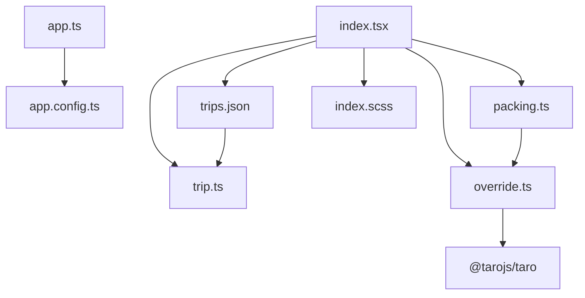
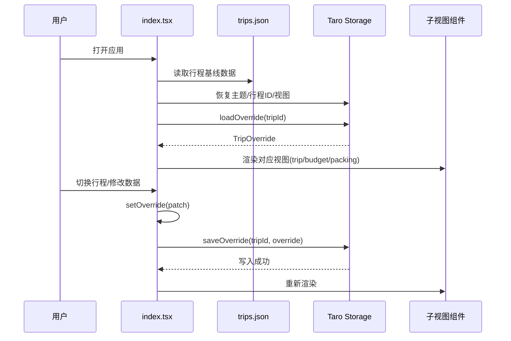
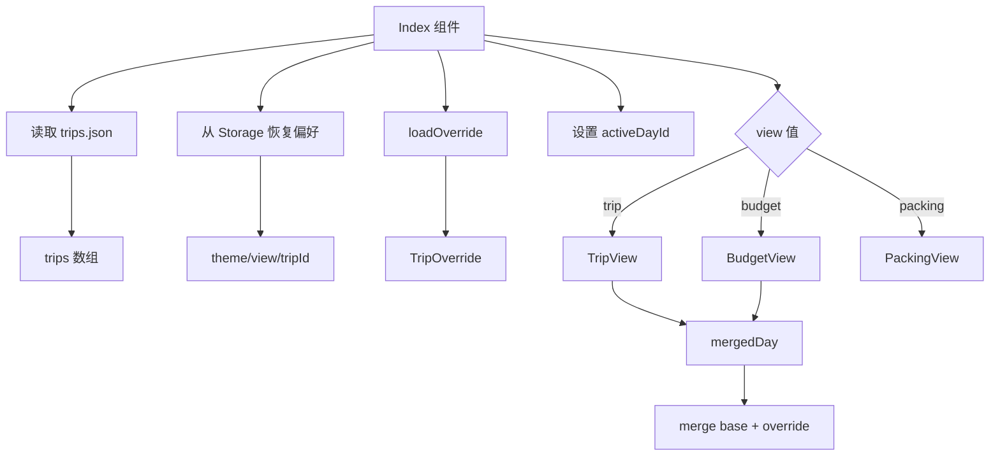
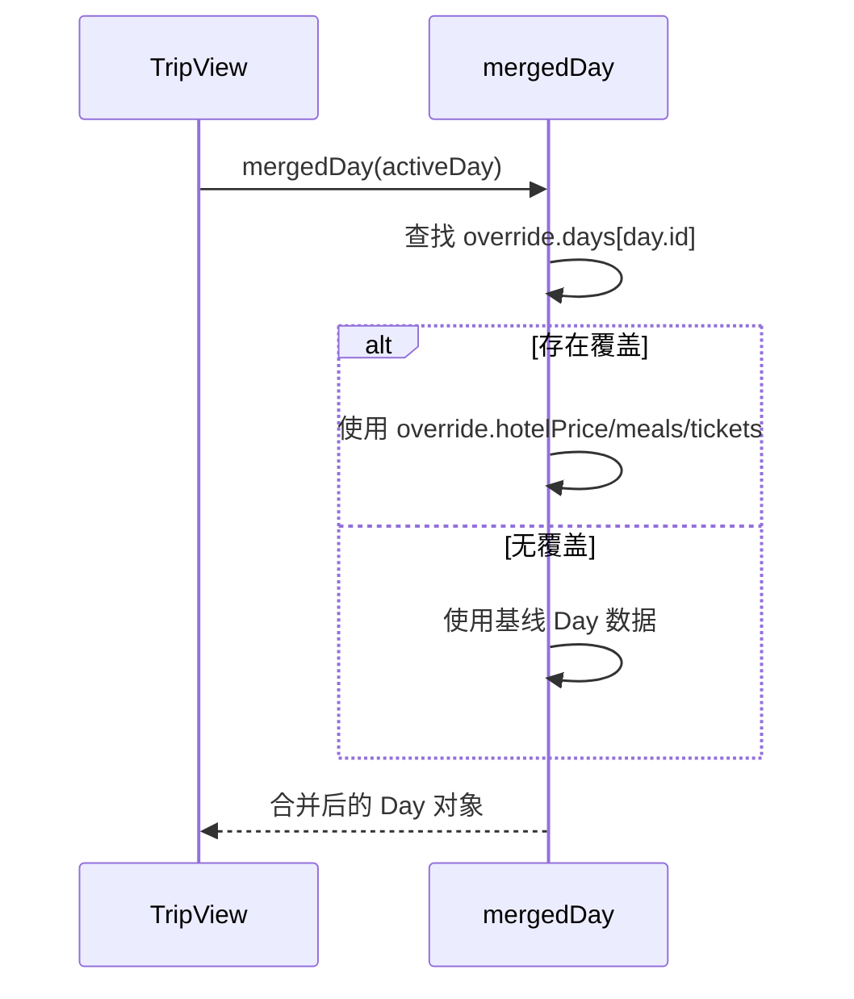
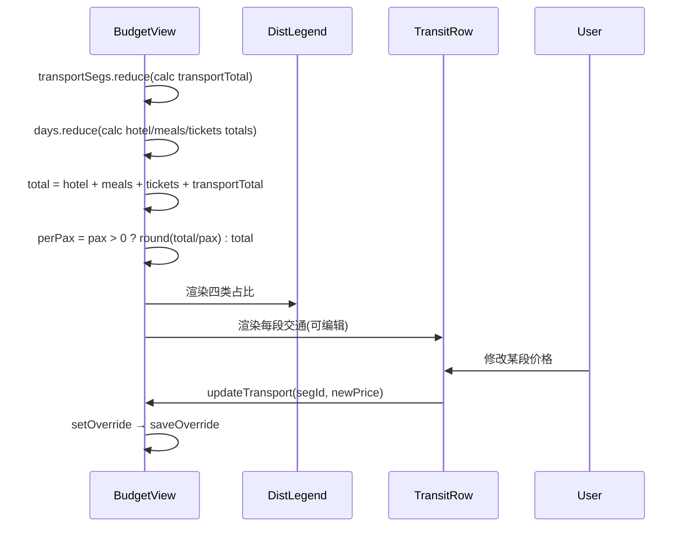
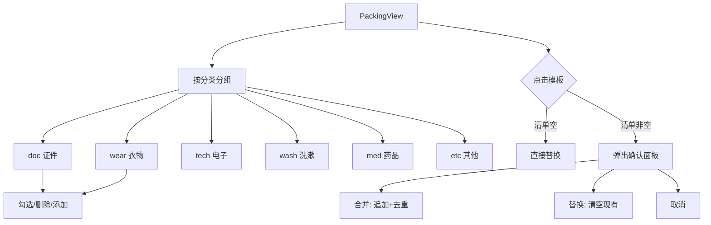
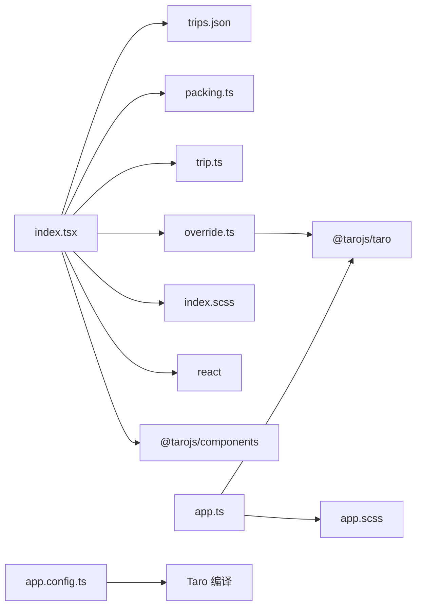

> **引用文件**: [app.config.ts:1-12](../../../src/app.config.ts#L1-L12), [app.ts:1-17](../../../src/app.ts#L1-L17), [index.config.ts:1-3](../../../src/pages/index/index.config.ts#L1-L3), [index.scss:1-684](../../../src/pages/index/index.scss#L1-L684), [index.tsx:1-567](../../../src/pages/index/index.tsx#L1-L567), [trips.json:1-1785](../../../src/data/trips.json#L1-L1785), [trip.ts:1-75](../../../src/types/trip.ts#L1-L75)

## 1. 引言

旅行行程管理能力是「行册」应用的核心业务模块，负责行程数据的存储、解析、展示和用户交互。该能力以 JSON 数据文件为持久层，通过 Taro 跨平台框架渲染为小程序页面，支持用户查看行程攻略、管理开销预算、整理出行清单三大视图。技术选型上，采用静态 JSON + 本地 Storage 覆盖方案替代服务端 API，减少部署复杂度并支持离线使用；以 React 函数组件 + Hooks 管理状态，保证组件间数据流的单向可预测性。

数据层（`trips.json`）包含完整的行程信息——天数、景点、交通、住宿、预算等——并支持多个行程共存。视图层（`index.tsx`）通过 `loadOverride`/`saveOverride` 机制将用户修改的用户态数据（如自定义开销、清单勾选）与静态基线数据合并渲染，实现"基线不可变、覆盖可编辑"的设计模式。主题系统支持四种视觉风格切换（手紙/杂志/明信片/极简），通过 CSS 变量控制全局样式。

> **章节来源**
> - [app.config.ts:1-12](../../../src/app.config.ts#L1-L12)
> - [app.ts:1-17](../../../src/app.ts#L1-L17)
> - [index.tsx:1-567](../../../src/pages/index/index.tsx#L1-L567)
> - [trip.ts:1-75](../../../src/types/trip.ts#L1-L75)

## 2. 项目结构

按角色分组描述相关文件如何组织：

- **应用入口层** — `src/app.ts` 定义 Taro 根组件，`useLaunch` 钩子记录启动日志；`src/app.config.ts` 配置小程序全局窗口样式（背景色、导航栏标题「行册」）和懒加载策略
- **数据层** — `src/data/trips.json` 存储所有行程的完整数据（景点、交通、住宿、天气、清单等），`src/data/packing.ts` 定义打包清单的类别、默认项和多场景模板（国内基础/夏季/冬季/高原/出境/短途）
- **类型层** — `src/types/trip.ts` 定义完整的 TypeScript 接口（Spot、Hotel、Weather、Day、TransportSegment、TripData、Trip、TripStore），确保数据契约一致性
- **工具层** — `src/utils/override.ts` 提供 `loadOverride`/`saveOverride`/`uid` 三个函数，通过 `Taro.setStorageSync` 实现用户态覆盖数据的本地持久化
- **页面层** — `src/pages/index/index.tsx` 主页面组件（568 行），包含三个子视图（TripView 攻略、BudgetView 开销、PackingView 清单）和主题/行程切换逻辑；`src/pages/index/index.scss` 提供完整的样式定义（685 行），按主题变量驱动视觉风格；`src/pages/index/index.config.ts` 配置页面导航栏标题

> **图表来源**
> - [index.tsx:1-10](../../../src/pages/index/index.tsx#L1-L10)
> - [override.ts:1-2](../../../src/utils/override.ts#L1-L2)
> - [trip.ts:1-75](../../../src/types/trip.ts#L1-L75)

> **章节来源**
> - [app.ts:1-17](../../../src/app.ts#L1-L17)
> - [app.config.ts:1-12](../../../src/app.config.ts#L1-L12)
> - [index.tsx:1-567](../../../src/pages/index/index.tsx#L1-L567)
> - [trip.ts:1-75](../../../src/types/trip.ts#L1-L75)
> - [override.ts:1-42](../../../src/utils/override.ts#L1-L42)

## 3. 架构总览

旅行行程管理能力位于 Taro 小程序的唯一页面（`pages/index/index`），是所有用户交互的集中入口。它与 Taro 框架的 Storage API 交互以读取/保存用户覆盖数据，与 JSON 数据文件交互以获取行程基线数据。外部依赖仅包括 `@tarojs/taro`（框架 API）、`@tarojs/components`（UI 组件）和 `react`（组件模型）。

主流程：
1. 应用启动，`app.ts` 渲染根组件，加载 `pages/index/index`
2. `index.tsx` 初始化：从 `trips.json` 读取所有行程，从 Storage 恢复主题/当前行程/视图偏好
3. 根据当前行程 ID 查找对应 Trip，加载用户覆盖数据（`loadOverride`）
4. 根据当前视图（trip/budget/packing）渲染对应子组件
5. 用户操作（切换行程、修改开销、勾选清单）触发 `setOverride` → `saveOverride` 写入 Storage

> **图表来源**
> - [index.tsx:45-72](../../../src/pages/index/index.tsx#L45-L72)
> - [override.ts:24-37](../../../src/utils/override.ts#L24-L37)
> - [index.tsx:151-229](../../../src/pages/index/index.tsx#L151-L229)

> **章节来源**
> - [index.tsx:1-567](../../../src/pages/index/index.tsx#L1-L567)
> - [override.ts:1-42](../../../src/utils/override.ts#L1-L42)

## 4. 核心组件

- **Index（主页面组件）**：行程数据管理、状态协调、视图路由。来源：[index.tsx:45-230](../../../src/pages/index/index.tsx#L45-L230)
- **TripView（攻略视图）**：按天展示行程景点，支持当日开销编辑。来源：[index.tsx:233-294](../../../src/pages/index/index.tsx#L233-L294)
- **BudgetView（开销视图）**：汇总交通、住宿、餐饮、门票四大类开销，计算人均和占比分布。来源：[index.tsx:314-406](../../../src/pages/index/index.tsx#L314-L406)
- **PackingView（清单视图）**：按分类展示打包清单，支持勾选、添加、删除和模板导入。来源：[index.tsx:444-567](../../../src/pages/index/index.tsx#L444-L567)
- **loadOverride/saveOverride（覆盖持久化工具）**：用户态数据的本地存储与加载。来源：[override.ts:24-37](../../../src/utils/override.ts#L24-L37)
- **mergedDay（数据合并函数）**：将基线 Day 数据与用户覆盖数据合并。来源：[index.tsx:84-99](../../../src/pages/index/index.tsx#L84-L99)

### Index（主页面组件）

`Index` 是整个能力的入口和状态中枢。它在挂载时完成四项初始化：读取 `trips.json` 获取所有行程基线、从 Storage 恢复主题/视图/当前行程偏好、加载用户覆盖数据（`loadOverride`）、设置默认激活日期。组件通过六个 state（theme、view、tripId、override、activeDayId、draft 等）管理全局状态，通过 `useEffect` 在 `tripId` 变化时自动加载新的覆盖数据并自动保存。

关键设计决策：
- **基线不可变**：`trips.json` 作为只读数据源，用户修改通过 `override` 层叠加，不直接修改基线。这使得数据更新（如 JSON 版本升级）不会丢失用户自定义内容
- **自动持久化**：`useEffect` 监听 `[tripId, override]`，任何覆盖变更自动写入 Storage，无需手动保存按钮
- **视图路由**：通过 `view` state 在 TripView/BudgetView/PackingView 间切换，而非多页面跳转，保持单页应用体验

> **图表来源**
> - [index.tsx:45-99](../../../src/pages/index/index.tsx#L45-L99)
> - [index.tsx:151-229](../../../src/pages/index/index.tsx#L151-L229)

### mergedDay（数据合并函数）

`mergedDay` 是攻略视图和开销视图的核心数据转换器。它接收基线 `Day` 对象，查找对应的 `DayOverride`（如果存在），将用户自定义的住宿价格、餐饮费用、门票费用覆盖到基线数据上。设计上采用不可变模式——返回全新对象而非修改入参，避免副作用。

关键逻辑：
- 住宿价格优先使用 `override.hotelPrice`，回退到 `d.hotel.price`
- 餐饮和门票同理，使用 `typeof o.meals === 'number'` 检查确保覆盖值有效
- 当基线无住宿但用户设置了覆盖价格时，构造虚拟 hotel 对象 `{ name: '（无住宿）', price: overridePrice, nights: 0, note: '' }`

> **图表来源**
> - [index.tsx:84-99](../../../src/pages/index/index.tsx#L84-L99)

> **章节来源**
> - [index.tsx:45-230](../../../src/pages/index/index.tsx#L45-L230)
> - [index.tsx:84-99](../../../src/pages/index/index.tsx#L84-L99)
> - [index.tsx:233-294](../../../src/pages/index/index.tsx#L233-L294)
> - [index.tsx:314-406](../../../src/pages/index/index.tsx#L314-L406)
> - [index.tsx:444-567](../../../src/pages/index/index.tsx#L444-L567)
> - [override.ts:24-37](../../../src/utils/override.ts#L24-L37)
## Purpose

提供基于静态 JSON 数据源的旅行行程管理能力，支持多行程切换、攻略浏览、开销预算统计和出行清单整理，所有用户自定义数据通过本地 Storage 持久化，无需服务端依赖。

> **章节来源**
> - [index.tsx:45-57](../../../src/pages/index/index.tsx#L45-L57)
> - [trips.json:1-6](../../../src/data/trips.json#L1-L6)

## Requirements

### Requirement: REQ-001 行程数据加载与切换

系统 SHALL 从 `trips.json` 加载所有行程基线数据，并支持用户通过顶栏行程切换器在不同行程间切换，切换时自动恢复该行程的用户覆盖数据。

> **来源**: [index.tsx:46-82](../../../src/pages/index/index.tsx#L46-L82)

#### Scenario: 正常加载默认行程

- **GIVEN** `trips.json` 中包含多个行程，`store.currentId` 为 `"trip-nj"`，Storage 中无 `trip-current-id-v1` 缓存
- **WHEN** 组件初始化，来源：[index.tsx:52-55](../../../src/pages/index/index.tsx#L52-L55)
- **THEN** `tripId` state 设为 `"trip-nj"`，`trip` useMemo 查找对应 Trip 对象，渲染该行程的攻略/开销/清单视图

#### Scenario: 从 Storage 恢复上次行程

- **GIVEN** Storage 中 `trip-current-id-v1` 键值为 `"trip-mohe"`，且该 ID 存在于 `trips` 数组中
- **WHEN** 组件初始化，来源：[index.tsx:52-55](../../../src/pages/index/index.tsx#L52-L55)
- **THEN** `tripId` state 设为 `"trip-mohe"`，跳过 `currentId` 回退逻辑

#### Scenario: 切换行程

- **GIVEN** 当前行程为 `"trip-nj"`，用户点击行程切换器中的 `"trip-jzg"` chip
- **WHEN** 调用 `switchTrip("trip-jzg")`，来源：[index.tsx:78-82](../../../src/pages/index/index.tsx#L78-L82)
- **THEN** `tripId` 更新为 `"trip-jzg"`，Storage 写入 `trip-current-id-v1 = "trip-jzg"`，`activeDayId` 重置为新行程的第一天 ID，`useEffect` 触发 `loadOverride("trip-jzg")`

---

### Requirement: REQ-002 用户覆盖数据持久化

系统 SHALL 通过 `Taro.setStorageSync` 保存用户对行程的自定义修改（开销、清单、交通价格），并在切换行程时通过 `Taro.getStorageSync` 恢复。

> **来源**: [override.ts:24-37](../../../src/utils/override.ts#L24-L37)

#### Scenario: 自动保存覆盖数据

- **GIVEN** 用户在攻略视图修改了 Day 1 的住宿价格为 600
- **WHEN** `setOverride` 触发，`useEffect` 监听 `[tripId, override]` 调用 `saveOverride`，来源：[index.tsx:71](../../../src/pages/index/index.tsx#L71)
- **THEN** `Taro.setStorageSync("trip-override::trip-nj", { days: {1: {hotelPrice: 600}}, packing: [...], transport: {} })` 写入成功

#### Scenario: 加载空覆盖数据

- **GIVEN** Storage 中不存在 `trip-override::trip-new` 键
- **WHEN** 调用 `loadOverride("trip-new")`，来源：[override.ts:24-33](../../../src/utils/override.ts#L24-L33)
- **THEN** 返回默认空对象 `{ days: {}, packing: [], transport: {} }`，组件检测到 `packing.length === 0` 时调用 `buildInitialPacking()` 生成默认清单

---

### Requirement: REQ-003 攻略视图与当日开销编辑

系统 SHALL 按天展示行程景点列表，并提供当日住宿/餐饮/门票三项开销的可编辑输入框，用户修改后实时更新覆盖数据。

> **来源**: [index.tsx:233-294](../../../src/pages/index/index.tsx#L233-L294)

#### Scenario: 正常展示景点列表

- **GIVEN** 当前行程为 `"trip-nj"`，激活 Day 1，Day 1 包含 5 个 spots（南京南站、美豪丽致酒店、德基广场、1912 街区、禄口机场）
- **WHEN** 渲染 TripView 组件，来源：[index.tsx:289-291](../../../src/pages/index/index.tsx#L289-L291)
- **THEN** 每个 Spot 渲染为 `SpotCard` 组件，显示图标（根据 `type` 映射：arrive→→、hotel→宿、spot→◆）、时间、名称和备注

#### Scenario: 编辑当日开销

- **GIVEN** 用户在攻略视图看到 Day 1 的开销面板（住宿 ¥500、餐饮 ¥200、门票 ¥0）
- **WHEN** 用户修改住宿输入框为 600，触发 `onInput` → `updateDayOverride(day.id, { hotelPrice: 600 })`，来源：[index.tsx:273-274](../../../src/pages/index/index.tsx#L273-L274)
- **THEN** `override.days[1].hotelPrice` 更新为 600，`mergedDay` 函数在下一次渲染时使用覆盖值 600 替代基线 500

---

### Requirement: REQ-004 开销汇总与人均计算

系统 SHALL 汇总行程所有天的住宿、餐饮、门票开销及交通费用，计算总开销和人均开销，并以分布条形图展示四大类占比。

> **来源**: [index.tsx:314-406](../../../src/pages/index/index.tsx#L314-L406)

#### Scenario: 正常计算总开销

- **GIVEN** 行程 `"trip-nj"` 共 4 天，合并后住宿总计 ¥2000、餐饮总计 ¥1900、门票总计 ¥350、交通 8 段总计 ¥2983，`pax = 4`
- **WHEN** 渲染 BudgetView 组件，来源：[index.tsx:324-334](../../../src/pages/index/index.tsx#L324-L334)
- **THEN** `total = 7233`，`perPax = Math.round(7233 / 4) = 1808`，分布条形图按四类占比百分比渲染宽度

#### Scenario: 人数为零时人均计算

- **GIVEN** 行程 `pax = 0`（边界情况）
- **WHEN** 计算 `perPax`，来源：[index.tsx:334](../../../src/pages/index/index.tsx#L334)
- **THEN** `perPax = total`（避免除以零），人均显示为总额

---

### Requirement: REQ-005 清单管理与模板导入

系统 SHALL 展示按分类（证件/衣物/电子/洗漱/药品/其他）分组的打包清单，支持勾选、添加、删除操作，并提供多场景模板导入功能。

> **来源**: [index.tsx:444-567](../../../src/pages/index/index.tsx#L444-L567)

#### Scenario: 勾选/取消勾选清单项

- **GIVEN** 清单包含 28 个默认项（来自 `DEFAULT_PACKING`），均未勾选
- **WHEN** 用户点击"身份证"项的 checkbox，触发 `togglePack(id)`，来源：[index.tsx:108-113](../../../src/pages/index/index.tsx#L108-L113)
- **THEN** 该项 `checked` 变为 `true`，`PackingView` 头部摘要显示 "1 / 28 已收拾"

#### Scenario: 添加自定义清单项

- **GIVEN** 用户在"衣物"分类输入框中输入"防晒霜"并确认
- **WHEN** 触发 `onAdd("wear", "防晒霜")`，来源：[index.tsx:115-121](../../../src/pages/index/index.tsx#L115-L121)
- **THEN** 新项 `{ id: uid(), category: "wear", label: "防晒霜", checked: false }` 追加到 `override.packing` 数组

#### Scenario: 导入模板（清单为空时直接替换）

- **GIVEN** 用户点击"模板"按钮，选择"江浙华南·夏"模板，当前 `items.length === 0`
- **WHEN** 调用 `handlePick(tpl)`，来源：[index.tsx:458-465](../../../src/pages/index/index.tsx#L458-L465)
- **THEN** 直接调用 `onApplyTemplate(tpl, 'replace')`，清单替换为模板的 12 个夏季物品

#### Scenario: 导入模板（清单非空时弹出确认）

- **GIVEN** 清单已包含 28 个默认项，用户选择"东北华北·冬"模板
- **WHEN** `handlePick(tpl)` 检测到 `items.length > 0`，设置 `pendingTpl` 弹出确认面板，来源：[index.tsx:497-526](../../../src/pages/index/index.tsx#L497-L526)
- **THEN** 用户可选择"合并"（追加去重）或"替换"（清空现有）或"取消"

---

### Requirement: REQ-006 主题切换

系统 SHALL 支持四种视觉主题（手紙/杂志/明信片/极简）切换，切换结果持久化到 Storage，下次启动自动恢复。

> **来源**: [index.tsx:49-76](../../../src/pages/index/index.tsx#L49-L76)

#### Scenario: 正常切换主题

- **GIVEN** 当前主题为 `"tegami"`，用户点击"杂志"按钮
- **WHEN** 调用 `switchTheme("magazine")`，来源：[index.tsx:76](../../../src/pages/index/index.tsx#L76)
- **THEN** `theme` state 更新为 `"magazine"`，Storage 写入 `trip-theme-v1 = "magazine"`，页面 className 变为 `page theme-magazine`

#### Scenario: 从 Storage 恢复主题

- **GIVEN** Storage 中 `trip-theme-v1` 键值为 `"postcard"`
- **WHEN** 组件初始化 `theme` state，来源：[index.tsx:49](../../../src/pages/index/index.tsx#L49)
- **THEN** `theme` 初始值为 `"postcard"`，回退默认值 `"tegami"` 不生效

> **章节来源**
> - [index.tsx:1-567](../../../src/pages/index/index.tsx#L1-L567)
> - [override.ts:1-42](../../../src/utils/override.ts#L1-L42)
> - [trips.json:1-1785](../../../src/data/trips.json#L1-L1785)
> - [trip.ts:1-75](../../../src/types/trip.ts#L1-L75)
## 5. 详细组件分析

### BudgetView（开销汇总视图）

BudgetView 是行程开销的聚合展示组件。它通过三次 `reduce` 操作分别计算交通总费用（遍历 `transport` 数组）、每日分类费用汇总（遍历 `days` 数组，调用 `mergedDay` 获取覆盖后的住宿/餐饮/门票），最后得出 `total` 和 `perPax`。设计上将所有计算逻辑放在渲染函数内而非抽离为独立 hook——因为计算量极小（最多 10 天 × 8 段交通），且依赖组件内 props，单独抽离会增加理解成本。

分布条形图采用 CSS `width` 内联样式按比例渲染四个色段，图例项（`DistLegend`）展示每类的绝对金额和百分比。交通部分使用 `Input` 组件提供行内编辑能力，用户修改某段交通价格后通过 `updateTransport` 更新 `override.transport`。

关键设计决策：
- **人数为零保护**：`perPax` 计算使用三元运算符检查 `pax > 0`，避免 `NaN` 渲染到界面
- **百分比宽度兜底**：`widthOf` 函数在 `total === 0` 时返回 `"25%"`，避免 `0%` 导致条形图不可见
- **输入回退**：`onInput` 解析 `parseInt` 后使用 `Number.isFinite(n) ? n : 0` 处理非数字输入

> **图表来源**
> - [index.tsx:314-406](../../../src/pages/index/index.tsx#L314-L406)

### PackingView（清单管理视图）

PackingView 实现了一个完整的清单管理系统。它以 `PACKING_CATEGORIES` 定义的六大分类为骨架，过滤 `override.packing` 中的项按分组渲染。每个清单项包含 checkbox（点击切换状态）、label（点击也切换状态，扩大点击区域）、和删除按钮（`×`）。

模板导入是此组件的核心亮点。当用户选择模板时，系统检测当前清单是否为空：空则直接替换；非空则弹出确认面板，提供"合并"/"替换"/"取消"三种策略。合并策略通过 `Set` 去重（key 为 `${category}::${label}`），确保不引入重复项。

设计决策：
- **模板与自定义共存**：模板导入不破坏用户已添加的自定义项（合并模式），且模板项使用新生成的 `uid()` 作为 ID，与现有项不冲突
- **输入框防抖缺失**：添加清单项的 `Input` 使用 `onConfirm` 而非 `onChange`，意味着用户需按回车/确认键才添加——这是小程序端的常见交互模式，但可能导致误触丢失输入

> **图表来源**
> - [index.tsx:444-567](../../../src/pages/index/index.tsx#L444-L567)
> - [packing.ts:1-86](../../../src/data/packing.ts#L1-L86)

> **章节来源**
> - [index.tsx:314-406](../../../src/pages/index/index.tsx#L314-L406)
> - [index.tsx:444-567](../../../src/pages/index/index.tsx#L444-L567)
> - [packing.ts:1-86](../../../src/data/packing.ts#L1-L86)

## 6. 依赖关系分析

### 内部依赖

文件间形成清晰的单向依赖链，无循环依赖：
- `index.tsx` 依赖 `trips.json`（数据源）、`packing.ts`（清单模板）、`trip.ts`（类型定义）、`override.ts`（持久化工具）、`index.scss`（样式）
- `override.ts` 依赖 `@tarojs/taro`（Storage API）
- `trip.ts` 无内部依赖（纯类型定义）
- `packing.ts` 无内部依赖（纯数据定义）

### 外部依赖

| 依赖 | 用途 | 来源 |
|------|------|------|
| `react` (useEffect, useMemo, useState) | 组件状态管理 | [index.tsx:1](../../../src/pages/index/index.tsx#L1) |
| `@tarojs/taro` | 小程序框架 API（Storage、导航） | [index.tsx:3](../../../src/pages/index/index.tsx#L3), [override.ts:1](../../../src/utils/override.ts#L1) |
| `@tarojs/components` (View, Text, ScrollView, Input) | UI 组件 | [index.tsx:2](../../../src/pages/index/index.tsx#L2) |

### 被依赖方

- `app.ts` 依赖 `app.scss`（全局样式，当前为空）和 `@tarojs/taro`
- `app.config.ts` 被 Taro 编译系统消费，定义小程序页面路由和全局窗口配置

> **图表来源**
> - [index.tsx:1-10](../../../src/pages/index/index.tsx#L1-L10)
> - [override.ts:1-2](../../../src/utils/override.ts#L1-L2)
> - [app.ts:1-4](../../../src/app.ts#L1-L4)

> **章节来源**
> - [index.tsx:1-10](../../../src/pages/index/index.tsx#L1-L10)
> - [override.ts:1-2](../../../src/utils/override.ts#L1-L2)
> - [app.ts:1-4](../../../src/app.ts#L1-L4)
> - [app.config.ts:1-12](../../../src/app.config.ts#L1-L12)

## Open Questions

1. `trips.json` 作为静态数据源，更新策略未明确——当 JSON 文件版本升级（`version` 字段变化）时，是否需要迁移用户已保存的覆盖数据？当前代码无版本检查逻辑
2. 清单模板导入的"合并"模式使用 `${category}::${label}` 作为去重 key，但如果同一标签出现在不同分类下（如"防晒霜"同时出现在 wash 和 wear）会被误判为重复——是否需要更精确的去重策略？
3. 天气数据（`weatherCache`）在 `trips.json` 中存在但未被 `index.tsx` 消费——是否预留了未来接入天气 API 的功能？当前天气信息仅显示基线数据中的 `day.weather`
4. 开销视图缺少按日明细展示——用户只能看到总额和分类汇总，无法快速定位某天的具体开销分布
5. `uid()` 函数使用 `Math.random().toString(36).slice(2, 10)` 生成 ID，碰撞概率在清单项较多时不可忽视——是否需要更可靠的 ID 生成方案（如 `crypto.randomUUID()`）？
6. 多行程间的数据共享机制未定义——如果用户想在多个行程间复用同一份清单，当前只能分别手动导入模板，无"复制清单"功能

> **章节来源**
> - [index.tsx:1-567](../../../src/pages/index/index.tsx#L1-L567)
> - [trips.json:1-1785](../../../src/data/trips.json#L1-L1785)
> - [override.ts:40-42](../../../src/utils/override.ts#L40-L42)
